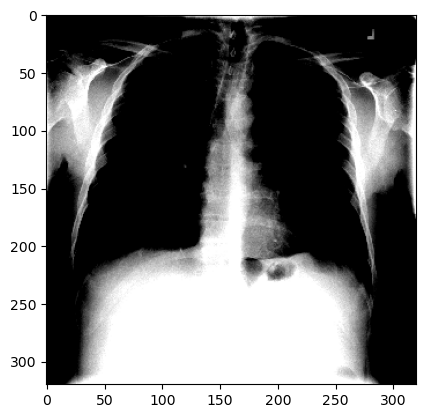
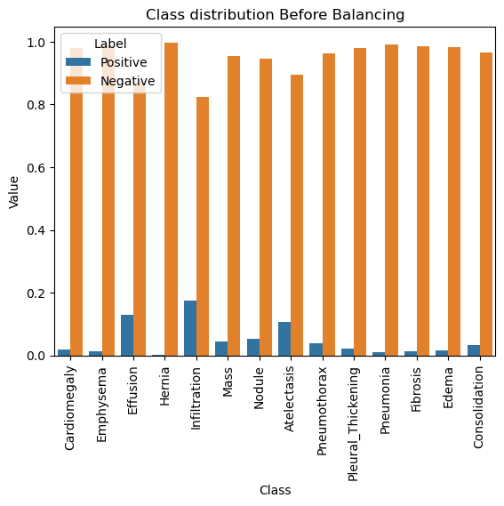
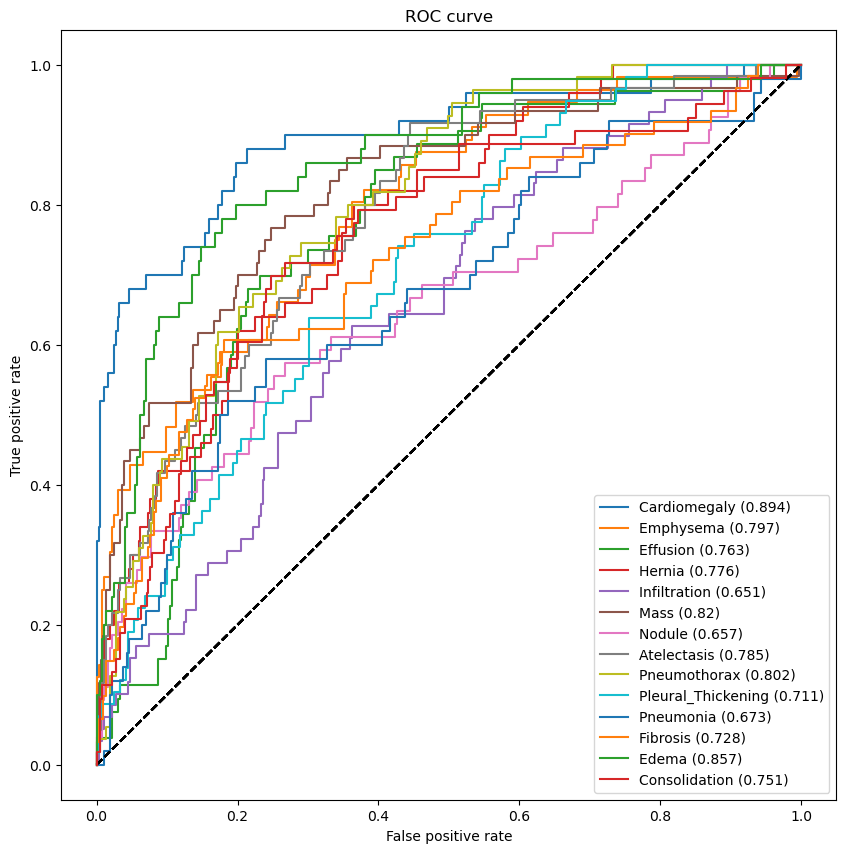
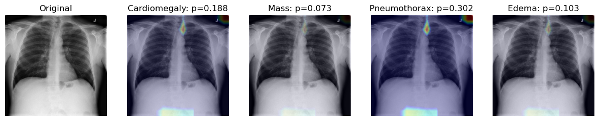
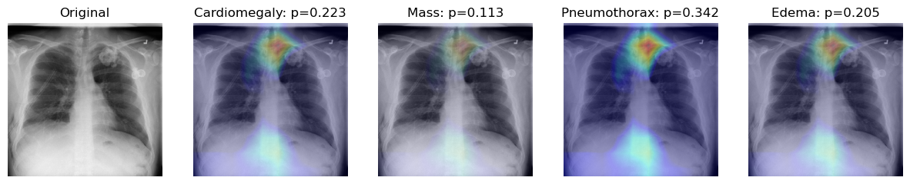

```python
import keras
import json
import numpy as np
import pandas as pd
# import nibabel as nib
import matplotlib.pyplot as plt
from tensorflow.keras import backend as K 

# import util
# from public_tests import *
# from test_utils import *
import nibabel as nib
import tensorflow as tf
tf.compat.v1.logging.set_verbosity(tf.compat.v1.logging.ERROR)

import src.utils.xraypp as xraypp
import src.utils.plotter as pltter
import src.utils.batchgenerator as dg
import src.utils.models as dl_models
```

## 0.1. Initialize the xray preprocessor object


```python
HOME_DIR_2D = "./data/nih/images-small/"
DATA_DIR_2D = HOME_DIR_2D
train_df = pd.read_csv("./data/nih/train-small.csv")
valid_df = pd.read_csv("./data/nih/valid-small.csv")
test_df = pd.read_csv("./data/nih/test.csv")
labels = ['Cardiomegaly', 
          'Emphysema', 
          'Effusion', 
          'Hernia', 
          'Infiltration', 
          'Mass', 
          'Nodule', 
          'Atelectasis',
          'Pneumothorax',
          'Pleural_Thickening', 
          'Pneumonia', 
          'Fibrosis', 
          'Edema', 
          'Consolidation']
xray_pp_obj = xraypp.XrayPP(
                 train_df=train_df,
                 valid_df=valid_df,
                 test_df=test_df,
                 img_dir=DATA_DIR_2D,
                 target_w=320,
                 target_h=320,
                 labels=labels,
                 )
```

    06/04//2024 01:21:1712389902 PM - INFO - XrayPP: Initializing the Medical Image Preprocessor Class
    06/04//2024 01:21:1712389902 PM - INFO - ComputeStats: Initializing the Compute Stats Class
    06/04//2024 01:21:1712389902 PM - INFO - XrayPP: Initializing the X-ray image preprocessing class
    06/04//2024 01:21:1712389902 PM - INFO - XrayPP: Initializing the X-ray image preprocessing class
    06/04//2024 01:21:1712389902 PM - INFO - XrayPP: Image Directory: data/nih/images-small
    06/04//2024 01:21:1712389902 PM - INFO - XrayPP: Image Directory: data/nih/images-small


```python
dg_xray = xray_pp_obj.get_generator(batch_size=32, num_channels=2)
```

    06/04//2024 01:21:1712389903 PM - INFO - XrayPP: Initializing the Data Generator For Training, Testing and Validation generators
    06/04//2024 01:21:1712389903 PM - INFO - XrayPP: Initializing the Data Generator For Training, Testing and Validation generators
    Found 1000 validated image filenames.
    Found 1000 validated image filenames.
    Found 200 validated image filenames.
    Found 420 validated image filenames.


```python
xray_pp_obj.update_kwargs()
```

    06/04//2024 01:21:1712389904 PM - INFO - XrayPP: Updating the kwargs for 2D model
    06/04//2024 01:21:1712389904 PM - INFO - XrayPP: Updating the kwargs for 2D model


    {'data_frames': {'train_df':                 Image  Atelectasis  Cardiomegaly  Consolidation  Edema  \
      0    00008270_015.png            0             0              0      0   
      1    00029855_001.png            1             0              0      0   
      2    00001297_000.png            0             0              0      0   
      3    00012359_002.png            0             0              0      0   
      4    00017951_001.png            0             0              0      0   
      ..                ...          ...           ...            ...    ...   
      995  00015869_010.png            0             0              0      0   
      996  00020113_005.png            0             0              0      0   
      997  00019939_000.png            0             0              0      0   
      998  00030496_000.png            0             0              0      0   
      999  00012363_002.png            0             0              0      0   
      
           Effusion  Emphysema  Fibrosis  Hernia  Infiltration  Mass  Nodule  \
      0           0          0         0       0             0     0       0   
      1           1          0         0       0             1     0       0   
      2           0          0         0       0             0     0       0   
      3           0          0         0       0             0     0       0   
      4           0          0         0       0             1     0       0   
      ..        ...        ...       ...     ...           ...   ...     ...   
      995         0          0         0       0             0     0       0   
      996         1          0         0       0             0     0       0   
      997         0          0         0       0             0     0       0   
      998         0          0         0       0             0     0       0   
      999         0          0         0       0             0     0       0   
      
           PatientId  Pleural_Thickening  Pneumonia  Pneumothorax  
      0         8270                   0          0             0  
      1        29855                   0          0             0  
      2         1297                   1          0             0  
      3        12359                   0          0             0  
      4        17951                   0          0             0  
      ..         ...                 ...        ...           ...  
      995      15869                   0          0             0  
      996      20113                   0          0             0  
      997      19939                   0          0             0  
      998      30496                   0          0             0  
      999      12363                   0          0             0  
      
      [1000 rows x 16 columns],
      'valid_df':                 Image  Atelectasis  Cardiomegaly  Consolidation  Edema  \
      0    00008270_015.png            0             0              0      0   
      1    00029855_001.png            1             0              0      0   
      2    00001297_000.png            0             0              0      0   
      3    00012359_002.png            0             0              0      0   
      4    00017951_001.png            0             0              0      0   
      ..                ...          ...           ...            ...    ...   
      195  00025695_017.png            0             0              0      0   
      196  00029454_000.png            0             0              0      0   
      197  00020213_004.png            0             0              0      0   
      198  00003272_000.png            0             0              0      0   
      199  00001108_004.png            1             0              0      0   
      
           Effusion  Emphysema  Fibrosis  Hernia  Infiltration  Mass  Nodule  \
      0           0          0         0       0             0     0       0   
      1           1          0         0       0             1     0       0   
      2           0          0         0       0             0     0       0   
      3           0          0         0       0             0     0       0   
      4           0          0         0       0             1     0       0   
      ..        ...        ...       ...     ...           ...   ...     ...   
      195         1          0         0       0             0     0       0   
      196         0          0         0       0             0     0       0   
      197         0          0         0       0             1     0       0   
      198         0          0         0       1             0     0       0   
      199         0          0         0       0             0     0       0   
      
           PatientId  Pleural_Thickening  Pneumonia  Pneumothorax  
      0         8270                   0          0             0  
      1        29855                   0          0             0  
      2         1297                   1          0             0  
      3        12359                   0          0             0  
      4        17951                   0          0             0  
      ..         ...                 ...        ...           ...  
      195      25695                   0          0             1  
      196      29454                   0          0             0  
      197      20213                   0          0             0  
      198       3272                   0          0             0  
      199       1108                   0          1             0  
      
      [200 rows x 16 columns],
      'test_df':                 Image  PatientId  Cardiomegaly  Emphysema  Effusion  Hernia  \
      0    00021463_005.png      21463             0          0         1       1   
      1    00019733_002.png      19733             0          0         0       1   
      2    00021463_001.png      21463             0          0         0       1   
      3    00017136_020.png      17136             0          0         0       1   
      4    00027477_000.png      27477             0          0         0       1   
      ..                ...        ...           ...        ...       ...     ...   
      415  00010497_000.png      10497             0          0         0       0   
      416  00017262_001.png      17262             0          0         0       0   
      417  00021653_000.png      21653             0          0         0       0   
      418  00017243_001.png      17243             0          0         0       0   
      419  00016142_013.png      16142             0          0         0       0   
      
           Infiltration  Mass  Nodule  Atelectasis  Pneumothorax  \
      0               1     0       0            1             0   
      1               0     0       0            1             0   
      2               0     0       0            0             0   
      3               0     0       0            0             0   
      4               1     0       0            0             0   
      ..            ...   ...     ...          ...           ...   
      415             0     1       0            0             0   
      416             0     1       0            0             0   
      417             0     1       0            0             0   
      418             0     1       0            0             1   
      419             1     1       0            1             0   
      
           Pleural_Thickening  Pneumonia  Fibrosis  Edema  Consolidation  
      0                     0          0         0      1              0  
      1                     0          0         0      0              0  
      2                     0          0         0      0              0  
      3                     0          0         0      0              0  
      4                     0          0         0      0              0  
      ..                  ...        ...       ...    ...            ...  
      415                   0          0         0      0              0  
      416                   0          0         0      0              0  
      417                   1          0         0      0              0  
      418                   1          0         0      0              0  
      419                   1          0         0      0              0  
      
      [420 rows x 16 columns]},
     'batch_size': 32,
     'dim': (320, 320, 16),
     'num_channels': 2,
     'num_classes': 14,
     'shuffle': False,
     'x_col': 'Image',
     'y_cols': ['Cardiomegaly',
      'Emphysema',
      'Effusion',
      'Hernia',
      'Infiltration',
      'Mass',
      'Nodule',
      'Atelectasis',
      'Pneumothorax',
      'Pleural_Thickening',
      'Pneumonia',
      'Fibrosis',
      'Edema',
      'Consolidation'],
     'train_generator': None,
     'test_generator': None,
     'valid_generator': None,
     'labels': ['Cardiomegaly',
      'Emphysema',
      'Effusion',
      'Hernia',
      'Infiltration',
      'Mass',
      'Nodule',
      'Atelectasis',
      'Pneumothorax',
      'Pleural_Thickening',
      'Pneumonia',
      'Fibrosis',
      'Edema',
      'Consolidation'],
     'pos_weights': None,
     'neg_weights': None,
     'orig_x': 240,
     'orig_y': 240,
     'orig_z': 155,
     'output_x': 160,
     'output_y': 160,
     'output_z': 16,
     'max_tries': 1000,
     'background_threshold': 0.95,
     'model_2d_or_3d': '2D'}


```python
xray_pp_obj.kwargs
```


    {'data_frames': {'train_df':                 Image  Atelectasis  Cardiomegaly  Consolidation  Edema  \
      0    00008270_015.png            0             0              0      0   
      1    00029855_001.png            1             0              0      0   
      2    00001297_000.png            0             0              0      0   
      3    00012359_002.png            0             0              0      0   
      4    00017951_001.png            0             0              0      0   
      ..                ...          ...           ...            ...    ...   
      995  00015869_010.png            0             0              0      0   
      996  00020113_005.png            0             0              0      0   
      997  00019939_000.png            0             0              0      0   
      998  00030496_000.png            0             0              0      0   
      999  00012363_002.png            0             0              0      0   
      
           Effusion  Emphysema  Fibrosis  Hernia  Infiltration  Mass  Nodule  \
      0           0          0         0       0             0     0       0   
      1           1          0         0       0             1     0       0   
      2           0          0         0       0             0     0       0   
      3           0          0         0       0             0     0       0   
      4           0          0         0       0             1     0       0   
      ..        ...        ...       ...     ...           ...   ...     ...   
      995         0          0         0       0             0     0       0   
      996         1          0         0       0             0     0       0   
      997         0          0         0       0             0     0       0   
      998         0          0         0       0             0     0       0   
      999         0          0         0       0             0     0       0   
      
           PatientId  Pleural_Thickening  Pneumonia  Pneumothorax  
      0         8270                   0          0             0  
      1        29855                   0          0             0  
      2         1297                   1          0             0  
      3        12359                   0          0             0  
      4        17951                   0          0             0  
      ..         ...                 ...        ...           ...  
      995      15869                   0          0             0  
      996      20113                   0          0             0  
      997      19939                   0          0             0  
      998      30496                   0          0             0  
      999      12363                   0          0             0  
      
      [1000 rows x 16 columns],
      'valid_df':                 Image  Atelectasis  Cardiomegaly  Consolidation  Edema  \
      0    00008270_015.png            0             0              0      0   
      1    00029855_001.png            1             0              0      0   
      2    00001297_000.png            0             0              0      0   
      3    00012359_002.png            0             0              0      0   
      4    00017951_001.png            0             0              0      0   
      ..                ...          ...           ...            ...    ...   
      195  00025695_017.png            0             0              0      0   
      196  00029454_000.png            0             0              0      0   
      197  00020213_004.png            0             0              0      0   
      198  00003272_000.png            0             0              0      0   
      199  00001108_004.png            1             0              0      0   
      
           Effusion  Emphysema  Fibrosis  Hernia  Infiltration  Mass  Nodule  \
      0           0          0         0       0             0     0       0   
      1           1          0         0       0             1     0       0   
      2           0          0         0       0             0     0       0   
      3           0          0         0       0             0     0       0   
      4           0          0         0       0             1     0       0   
      ..        ...        ...       ...     ...           ...   ...     ...   
      195         1          0         0       0             0     0       0   
      196         0          0         0       0             0     0       0   
      197         0          0         0       0             1     0       0   
      198         0          0         0       1             0     0       0   
      199         0          0         0       0             0     0       0   
      
           PatientId  Pleural_Thickening  Pneumonia  Pneumothorax  
      0         8270                   0          0             0  
      1        29855                   0          0             0  
      2         1297                   1          0             0  
      3        12359                   0          0             0  
      4        17951                   0          0             0  
      ..         ...                 ...        ...           ...  
      195      25695                   0          0             1  
      196      29454                   0          0             0  
      197      20213                   0          0             0  
      198       3272                   0          0             0  
      199       1108                   0          1             0  
      
      [200 rows x 16 columns],
      'test_df':                 Image  PatientId  Cardiomegaly  Emphysema  Effusion  Hernia  \
      0    00021463_005.png      21463             0          0         1       1   
      1    00019733_002.png      19733             0          0         0       1   
      2    00021463_001.png      21463             0          0         0       1   
      3    00017136_020.png      17136             0          0         0       1   
      4    00027477_000.png      27477             0          0         0       1   
      ..                ...        ...           ...        ...       ...     ...   
      415  00010497_000.png      10497             0          0         0       0   
      416  00017262_001.png      17262             0          0         0       0   
      417  00021653_000.png      21653             0          0         0       0   
      418  00017243_001.png      17243             0          0         0       0   
      419  00016142_013.png      16142             0          0         0       0   
      
           Infiltration  Mass  Nodule  Atelectasis  Pneumothorax  \
      0               1     0       0            1             0   
      1               0     0       0            1             0   
      2               0     0       0            0             0   
      3               0     0       0            0             0   
      4               1     0       0            0             0   
      ..            ...   ...     ...          ...           ...   
      415             0     1       0            0             0   
      416             0     1       0            0             0   
      417             0     1       0            0             0   
      418             0     1       0            0             1   
      419             1     1       0            1             0   
      
           Pleural_Thickening  Pneumonia  Fibrosis  Edema  Consolidation  
      0                     0          0         0      1              0  
      1                     0          0         0      0              0  
      2                     0          0         0      0              0  
      3                     0          0         0      0              0  
      4                     0          0         0      0              0  
      ..                  ...        ...       ...    ...            ...  
      415                   0          0         0      0              0  
      416                   0          0         0      0              0  
      417                   1          0         0      0              0  
      418                   1          0         0      0              0  
      419                   1          0         0      0              0  
      
      [420 rows x 16 columns]},
     'batch_size': 32,
     'dim': (320, 320, 16),
     'num_channels': 2,
     'num_classes': 14,
     'shuffle': False,
     'x_col': 'Image',
     'y_cols': ['Cardiomegaly',
      'Emphysema',
      'Effusion',
      'Hernia',
      'Infiltration',
      'Mass',
      'Nodule',
      'Atelectasis',
      'Pneumothorax',
      'Pleural_Thickening',
      'Pneumonia',
      'Fibrosis',
      'Edema',
      'Consolidation'],
     'train_generator': None,
     'test_generator': None,
     'valid_generator': None,
     'labels': ['Cardiomegaly',
      'Emphysema',
      'Effusion',
      'Hernia',
      'Infiltration',
      'Mass',
      'Nodule',
      'Atelectasis',
      'Pneumothorax',
      'Pleural_Thickening',
      'Pneumonia',
      'Fibrosis',
      'Edema',
      'Consolidation'],
     'pos_weights': None,
     'neg_weights': None,
     'orig_x': 240,
     'orig_y': 240,
     'orig_z': 155,
     'output_x': 160,
     'output_y': 160,
     'output_z': 16,
     'max_tries': 1000,
     'background_threshold': 0.95,
     'model_2d_or_3d': '2D'}


```python
train_generator = dg_xray.get_train_generator()
valid_generator, test_generator = dg_xray.get_test_and_valid_generator()
```

    Found 1000 validated image filenames.
    Found 1000 validated image filenames.
    Found 200 validated image filenames.
    Found 420 validated image filenames.


```python
x, y = train_generator.__getitem__(0)
plt.imshow(x[0]);
```

    Clipping input data to the valid range for imshow with RGB data ([0..1] for floats or [0..255] for integers).


    

    


## 1.0. Applying DenseNet Model using models and compute stats modules to imbalanced Chest X-Ray Datasets


```python
import numpy as np
import pandas as pd
import seaborn as sns
import matplotlib.pyplot as plt

from keras.preprocessing.image import ImageDataGenerator
from keras.applications.densenet import DenseNet121
from keras.layers import Dense, GlobalAveragePooling2D
from keras.models import Model
from keras import backend as K

from keras.models import load_model

# import util
# from public_tests import *
# from test_utils import *

import tensorflow as tf
tf.compat.v1.logging.set_verbosity(tf.compat.v1.logging.ERROR)
```

## 1.1. Get contributions and frequencies of positive, negative classes using training data


```python

model_obj = dl_models.DLModels(model_2d_dir='./models/nih/densenet.hdf5', model_3d_dir='./models/pretrained_model.h5', pre_trained_wts='./models/nih/pretrained_model.h5')
labels = xray_pp_obj.labels
freq_pos, freq_neg = model_obj.cs.compute_class_freqs(train_generator.labels)
pos_neg_dict = model_obj.cs.calc_pos_neg_weights(freq_pos=freq_pos, freq_neg=freq_neg)

```

    06/04//2024 01:21:1712389910 PM - INFO - DLModels: Initializing the Deep Learning Model Class
    06/04//2024 01:21:1712389910 PM - INFO - ComputeStats: Initializing the Compute Stats Class
    06/04//2024 01:21:1712389910 PM - INFO - ComputeStats: Initializing the Compute Stats Class


```python
# Create DataFrame for positive values
pos_data = pd.DataFrame({"Class": labels, "Label": "Positive", "Value": freq_pos})

# Create DataFrame for negative values
neg_data = pd.DataFrame([{"Class": labels[l], "Label": "Negative", "Value": v} for l, v in enumerate(freq_neg)])

# Concatenate positive and negative data
data = pd.concat([pos_data, neg_data], ignore_index=True)

# Plot data
plt.xticks(rotation=90)
f = sns.barplot(x="Class", y="Value", hue="Label", data=data)
f.set_title('Class distribution Before Balancing')
```


    Text(0.5, 1.0, 'Class distribution Before Balancing')


    

    


```python
# Create DataFrame for positive contributions
pos_data = pd.DataFrame({"Class": labels, "Label": "Positive", "Value": pos_neg_dict['pos_contribution'] })

# Create DataFrame for negative contributions
neg_data = pd.DataFrame([{"Class": labels[l], "Label": "Negative", "Value": v} for l, v in enumerate(pos_neg_dict['neg_contribution'])])

# Concatenate positive and negative contributions
data = pd.concat([pos_data, neg_data], ignore_index=True)

# Plot data
plt.xticks(rotation=90)
g = sns.barplot(x="Class", y="Value", hue="Label" ,data=data);
g.set_title('Class distribution After Balancing')
```


    Text(0.5, 1.0, 'Class distribution After Balancing')


    

    


## 1.2. Get DenseNet Model Summary


```python
kwargs = {
        'test_generator': test_generator,
        'labels': labels,
        'pos_weights': pos_neg_dict['pos_weights'],
        'neg_weights': pos_neg_dict['neg_weights'],
}

model_2d = model_obj.weighted_dense_net_model_2d(**kwargs)
model_2d.summary()
```

    Model: "model"
    __________________________________________________________________________________________________
     Layer (type)                   Output Shape         Param #     Connected to                     
    ==================================================================================================
     input_1 (InputLayer)           [(None, None, None,  0           []                               
                                     3)]                                                              
                                                                                                      
     zero_padding2d (ZeroPadding2D)  (None, None, None,   0          ['input_1[0][0]']                
                                    3)                                                                
                                                                                                      
     conv1/conv (Conv2D)            (None, None, None,   9408        ['zero_padding2d[0][0]']         
                                    64)                                                               
                                                                                                      
     conv1/bn (BatchNormalization)  (None, None, None,   256         ['conv1/conv[0][0]']             
                                    64)                                                               
                                                                                                      
     conv1/relu (Activation)        (None, None, None,   0           ['conv1/bn[0][0]']               
                                    64)                                                               
                                                                                                      
     zero_padding2d_1 (ZeroPadding2  (None, None, None,   0          ['conv1/relu[0][0]']             
     D)                             64)                                                               
                                                                                                      
     pool1 (MaxPooling2D)           (None, None, None,   0           ['zero_padding2d_1[0][0]']       
                                    64)                                                               
                                                                                                      
     conv2_block1_0_bn (BatchNormal  (None, None, None,   256        ['pool1[0][0]']                  
     ization)                       64)                                                               
                                                                                                      
     conv2_block1_0_relu (Activatio  (None, None, None,   0          ['conv2_block1_0_bn[0][0]']      
     n)                             64)                                                               
                                                                                                      
     conv2_block1_1_conv (Conv2D)   (None, None, None,   8192        ['conv2_block1_0_relu[0][0]']    
                                    128)                                                              
                                                                                                      
     conv2_block1_1_bn (BatchNormal  (None, None, None,   512        ['conv2_block1_1_conv[0][0]']    
     ization)                       128)                                                              
                                                                                                      
     conv2_block1_1_relu (Activatio  (None, None, None,   0          ['conv2_block1_1_bn[0][0]']      
     n)                             128)                                                              
                                                                                                      
     conv2_block1_2_conv (Conv2D)   (None, None, None,   36864       ['conv2_block1_1_relu[0][0]']    
                                    32)                                                               
                                                                                                      
     conv2_block1_concat (Concatena  (None, None, None,   0          ['pool1[0][0]',                  
     te)                            96)                               'conv2_block1_2_conv[0][0]']    
                                                                                                      
     conv2_block2_0_bn (BatchNormal  (None, None, None,   384        ['conv2_block1_concat[0][0]']    
     ization)                       96)                                                               
                                                                                                      
     conv2_block2_0_relu (Activatio  (None, None, None,   0          ['conv2_block2_0_bn[0][0]']      
     n)                             96)                                                               
                                                                                                      
     conv2_block2_1_conv (Conv2D)   (None, None, None,   12288       ['conv2_block2_0_relu[0][0]']    
                                    128)                                                              
                                                                                                      
     conv2_block2_1_bn (BatchNormal  (None, None, None,   512        ['conv2_block2_1_conv[0][0]']    
     ization)                       128)                                                              
                                                                                                      
     conv2_block2_1_relu (Activatio  (None, None, None,   0          ['conv2_block2_1_bn[0][0]']      
     n)                             128)                                                              
                                                                                                      
     conv2_block2_2_conv (Conv2D)   (None, None, None,   36864       ['conv2_block2_1_relu[0][0]']    
                                    32)                                                               
                                                                                                      
     conv2_block2_concat (Concatena  (None, None, None,   0          ['conv2_block1_concat[0][0]',    
     te)                            128)                              'conv2_block2_2_conv[0][0]']    
                                                                                                      
     conv2_block3_0_bn (BatchNormal  (None, None, None,   512        ['conv2_block2_concat[0][0]']    
     ization)                       128)                                                              
                                                                                                      
     conv2_block3_0_relu (Activatio  (None, None, None,   0          ['conv2_block3_0_bn[0][0]']      
     n)                             128)                                                              
                                                                                                      
     conv2_block3_1_conv (Conv2D)   (None, None, None,   16384       ['conv2_block3_0_relu[0][0]']    
                                    128)                                                              
                                                                                                      
     conv2_block3_1_bn (BatchNormal  (None, None, None,   512        ['conv2_block3_1_conv[0][0]']    
     ization)                       128)                                                              
                                                                                                      
     conv2_block3_1_relu (Activatio  (None, None, None,   0          ['conv2_block3_1_bn[0][0]']      
     n)                             128)                                                              
                                                                                                      
     conv2_block3_2_conv (Conv2D)   (None, None, None,   36864       ['conv2_block3_1_relu[0][0]']    
                                    32)                                                               
                                                                                                      
     conv2_block3_concat (Concatena  (None, None, None,   0          ['conv2_block2_concat[0][0]',    
     te)                            160)                              'conv2_block3_2_conv[0][0]']    
                                                                                                      
     conv2_block4_0_bn (BatchNormal  (None, None, None,   640        ['conv2_block3_concat[0][0]']    
     ization)                       160)                                                              
                                                                                                      
     conv2_block4_0_relu (Activatio  (None, None, None,   0          ['conv2_block4_0_bn[0][0]']      
     n)                             160)                                                              
                                                                                                      
     conv2_block4_1_conv (Conv2D)   (None, None, None,   20480       ['conv2_block4_0_relu[0][0]']    
                                    128)                                                              
                                                                                                      
     conv2_block4_1_bn (BatchNormal  (None, None, None,   512        ['conv2_block4_1_conv[0][0]']    
     ization)                       128)                                                              
                                                                                                      
     conv2_block4_1_relu (Activatio  (None, None, None,   0          ['conv2_block4_1_bn[0][0]']      
     n)                             128)                                                              
                                                                                                      
     conv2_block4_2_conv (Conv2D)   (None, None, None,   36864       ['conv2_block4_1_relu[0][0]']    
                                    32)                                                               
                                                                                                      
     conv2_block4_concat (Concatena  (None, None, None,   0          ['conv2_block3_concat[0][0]',    
     te)                            192)                              'conv2_block4_2_conv[0][0]']    
                                                                                                      
     conv2_block5_0_bn (BatchNormal  (None, None, None,   768        ['conv2_block4_concat[0][0]']    
     ization)                       192)                                                              
                                                                                                      
     conv2_block5_0_relu (Activatio  (None, None, None,   0          ['conv2_block5_0_bn[0][0]']      
     n)                             192)                                                              
                                                                                                      
     conv2_block5_1_conv (Conv2D)   (None, None, None,   24576       ['conv2_block5_0_relu[0][0]']    
                                    128)                                                              
                                                                                                      
     conv2_block5_1_bn (BatchNormal  (None, None, None,   512        ['conv2_block5_1_conv[0][0]']    
     ization)                       128)                                                              
                                                                                                      
     conv2_block5_1_relu (Activatio  (None, None, None,   0          ['conv2_block5_1_bn[0][0]']      
     n)                             128)                                                              
                                                                                                      
     conv2_block5_2_conv (Conv2D)   (None, None, None,   36864       ['conv2_block5_1_relu[0][0]']    
                                    32)                                                               
                                                                                                      
     conv2_block5_concat (Concatena  (None, None, None,   0          ['conv2_block4_concat[0][0]',    
     te)                            224)                              'conv2_block5_2_conv[0][0]']    
                                                                                                      
     conv2_block6_0_bn (BatchNormal  (None, None, None,   896        ['conv2_block5_concat[0][0]']    
     ization)                       224)                                                              
                                                                                                      
     conv2_block6_0_relu (Activatio  (None, None, None,   0          ['conv2_block6_0_bn[0][0]']      
     n)                             224)                                                              
                                                                                                      
     conv2_block6_1_conv (Conv2D)   (None, None, None,   28672       ['conv2_block6_0_relu[0][0]']    
                                    128)                                                              
                                                                                                      
     conv2_block6_1_bn (BatchNormal  (None, None, None,   512        ['conv2_block6_1_conv[0][0]']    
     ization)                       128)                                                              
                                                                                                      
     conv2_block6_1_relu (Activatio  (None, None, None,   0          ['conv2_block6_1_bn[0][0]']      
     n)                             128)                                                              
                                                                                                      
     conv2_block6_2_conv (Conv2D)   (None, None, None,   36864       ['conv2_block6_1_relu[0][0]']    
                                    32)                                                               
                                                                                                      
     conv2_block6_concat (Concatena  (None, None, None,   0          ['conv2_block5_concat[0][0]',    
     te)                            256)                              'conv2_block6_2_conv[0][0]']    
                                                                                                      
     pool2_bn (BatchNormalization)  (None, None, None,   1024        ['conv2_block6_concat[0][0]']    
                                    256)                                                              
                                                                                                      
     pool2_relu (Activation)        (None, None, None,   0           ['pool2_bn[0][0]']               
                                    256)                                                              
                                                                                                      
     pool2_conv (Conv2D)            (None, None, None,   32768       ['pool2_relu[0][0]']             
                                    128)                                                              
                                                                                                      
     pool2_pool (AveragePooling2D)  (None, None, None,   0           ['pool2_conv[0][0]']             
                                    128)                                                              
                                                                                                      
     conv3_block1_0_bn (BatchNormal  (None, None, None,   512        ['pool2_pool[0][0]']             
     ization)                       128)                                                              
                                                                                                      
     conv3_block1_0_relu (Activatio  (None, None, None,   0          ['conv3_block1_0_bn[0][0]']      
     n)                             128)                                                              
                                                                                                      
     conv3_block1_1_conv (Conv2D)   (None, None, None,   16384       ['conv3_block1_0_relu[0][0]']    
                                    128)                                                              
                                                                                                      
     conv3_block1_1_bn (BatchNormal  (None, None, None,   512        ['conv3_block1_1_conv[0][0]']    
     ization)                       128)                                                              
                                                                                                      
     conv3_block1_1_relu (Activatio  (None, None, None,   0          ['conv3_block1_1_bn[0][0]']      
     n)                             128)                                                              
                                                                                                      
     conv3_block1_2_conv (Conv2D)   (None, None, None,   36864       ['conv3_block1_1_relu[0][0]']    
                                    32)                                                               
                                                                                                      
     conv3_block1_concat (Concatena  (None, None, None,   0          ['pool2_pool[0][0]',             
     te)                            160)                              'conv3_block1_2_conv[0][0]']    
                                                                                                      
     conv3_block2_0_bn (BatchNormal  (None, None, None,   640        ['conv3_block1_concat[0][0]']    
     ization)                       160)                                                              
                                                                                                      
     conv3_block2_0_relu (Activatio  (None, None, None,   0          ['conv3_block2_0_bn[0][0]']      
     n)                             160)                                                              
                                                                                                      
     conv3_block2_1_conv (Conv2D)   (None, None, None,   20480       ['conv3_block2_0_relu[0][0]']    
                                    128)                                                              
                                                                                                      
     conv3_block2_1_bn (BatchNormal  (None, None, None,   512        ['conv3_block2_1_conv[0][0]']    
     ization)                       128)                                                              
                                                                                                      
     conv3_block2_1_relu (Activatio  (None, None, None,   0          ['conv3_block2_1_bn[0][0]']      
     n)                             128)                                                              
                                                                                                      
     conv3_block2_2_conv (Conv2D)   (None, None, None,   36864       ['conv3_block2_1_relu[0][0]']    
                                    32)                                                               
                                                                                                      
     conv3_block2_concat (Concatena  (None, None, None,   0          ['conv3_block1_concat[0][0]',    
     te)                            192)                              'conv3_block2_2_conv[0][0]']    
                                                                                                      
     conv3_block3_0_bn (BatchNormal  (None, None, None,   768        ['conv3_block2_concat[0][0]']    
     ization)                       192)                                                              
                                                                                                      
     conv3_block3_0_relu (Activatio  (None, None, None,   0          ['conv3_block3_0_bn[0][0]']      
     n)                             192)                                                              
                                                                                                      
     conv3_block3_1_conv (Conv2D)   (None, None, None,   24576       ['conv3_block3_0_relu[0][0]']    
                                    128)                                                              
                                                                                                      
     conv3_block3_1_bn (BatchNormal  (None, None, None,   512        ['conv3_block3_1_conv[0][0]']    
     ization)                       128)                                                              
                                                                                                      
     conv3_block3_1_relu (Activatio  (None, None, None,   0          ['conv3_block3_1_bn[0][0]']      
     n)                             128)                                                              
                                                                                                      
     conv3_block3_2_conv (Conv2D)   (None, None, None,   36864       ['conv3_block3_1_relu[0][0]']    
                                    32)                                                               
                                                                                                      
     conv3_block3_concat (Concatena  (None, None, None,   0          ['conv3_block2_concat[0][0]',    
     te)                            224)                              'conv3_block3_2_conv[0][0]']    
                                                                                                      
     conv3_block4_0_bn (BatchNormal  (None, None, None,   896        ['conv3_block3_concat[0][0]']    
     ization)                       224)                                                              
                                                                                                      
     conv3_block4_0_relu (Activatio  (None, None, None,   0          ['conv3_block4_0_bn[0][0]']      
     n)                             224)                                                              
                                                                                                      
     conv3_block4_1_conv (Conv2D)   (None, None, None,   28672       ['conv3_block4_0_relu[0][0]']    
                                    128)                                                              
                                                                                                      
     conv3_block4_1_bn (BatchNormal  (None, None, None,   512        ['conv3_block4_1_conv[0][0]']    
     ization)                       128)                                                              
                                                                                                      
     conv3_block4_1_relu (Activatio  (None, None, None,   0          ['conv3_block4_1_bn[0][0]']      
     n)                             128)                                                              
                                                                                                      
     conv3_block4_2_conv (Conv2D)   (None, None, None,   36864       ['conv3_block4_1_relu[0][0]']    
                                    32)                                                               
                                                                                                      
     conv3_block4_concat (Concatena  (None, None, None,   0          ['conv3_block3_concat[0][0]',    
     te)                            256)                              'conv3_block4_2_conv[0][0]']    
                                                                                                      
     conv3_block5_0_bn (BatchNormal  (None, None, None,   1024       ['conv3_block4_concat[0][0]']    
     ization)                       256)                                                              
                                                                                                      
     conv3_block5_0_relu (Activatio  (None, None, None,   0          ['conv3_block5_0_bn[0][0]']      
     n)                             256)                                                              
                                                                                                      
     conv3_block5_1_conv (Conv2D)   (None, None, None,   32768       ['conv3_block5_0_relu[0][0]']    
                                    128)                                                              
                                                                                                      
     conv3_block5_1_bn (BatchNormal  (None, None, None,   512        ['conv3_block5_1_conv[0][0]']    
     ization)                       128)                                                              
                                                                                                      
     conv3_block5_1_relu (Activatio  (None, None, None,   0          ['conv3_block5_1_bn[0][0]']      
     n)                             128)                                                              
                                                                                                      
     conv3_block5_2_conv (Conv2D)   (None, None, None,   36864       ['conv3_block5_1_relu[0][0]']    
                                    32)                                                               
                                                                                                      
     conv3_block5_concat (Concatena  (None, None, None,   0          ['conv3_block4_concat[0][0]',    
     te)                            288)                              'conv3_block5_2_conv[0][0]']    
                                                                                                      
     conv3_block6_0_bn (BatchNormal  (None, None, None,   1152       ['conv3_block5_concat[0][0]']    
     ization)                       288)                                                              
                                                                                                      
     conv3_block6_0_relu (Activatio  (None, None, None,   0          ['conv3_block6_0_bn[0][0]']      
     n)                             288)                                                              
                                                                                                      
     conv3_block6_1_conv (Conv2D)   (None, None, None,   36864       ['conv3_block6_0_relu[0][0]']    
                                    128)                                                              
                                                                                                      
     conv3_block6_1_bn (BatchNormal  (None, None, None,   512        ['conv3_block6_1_conv[0][0]']    
     ization)                       128)                                                              
                                                                                                      
     conv3_block6_1_relu (Activatio  (None, None, None,   0          ['conv3_block6_1_bn[0][0]']      
     n)                             128)                                                              
                                                                                                      
     conv3_block6_2_conv (Conv2D)   (None, None, None,   36864       ['conv3_block6_1_relu[0][0]']    
                                    32)                                                               
                                                                                                      
     conv3_block6_concat (Concatena  (None, None, None,   0          ['conv3_block5_concat[0][0]',    
     te)                            320)                              'conv3_block6_2_conv[0][0]']    
                                                                                                      
     conv3_block7_0_bn (BatchNormal  (None, None, None,   1280       ['conv3_block6_concat[0][0]']    
     ization)                       320)                                                              
                                                                                                      
     conv3_block7_0_relu (Activatio  (None, None, None,   0          ['conv3_block7_0_bn[0][0]']      
     n)                             320)                                                              
                                                                                                      
     conv3_block7_1_conv (Conv2D)   (None, None, None,   40960       ['conv3_block7_0_relu[0][0]']    
                                    128)                                                              
                                                                                                      
     conv3_block7_1_bn (BatchNormal  (None, None, None,   512        ['conv3_block7_1_conv[0][0]']    
     ization)                       128)                                                              
                                                                                                      
     conv3_block7_1_relu (Activatio  (None, None, None,   0          ['conv3_block7_1_bn[0][0]']      
     n)                             128)                                                              
                                                                                                      
     conv3_block7_2_conv (Conv2D)   (None, None, None,   36864       ['conv3_block7_1_relu[0][0]']    
                                    32)                                                               
                                                                                                      
     conv3_block7_concat (Concatena  (None, None, None,   0          ['conv3_block6_concat[0][0]',    
     te)                            352)                              'conv3_block7_2_conv[0][0]']    
                                                                                                      
     conv3_block8_0_bn (BatchNormal  (None, None, None,   1408       ['conv3_block7_concat[0][0]']    
     ization)                       352)                                                              
                                                                                                      
     conv3_block8_0_relu (Activatio  (None, None, None,   0          ['conv3_block8_0_bn[0][0]']      
     n)                             352)                                                              
                                                                                                      
     conv3_block8_1_conv (Conv2D)   (None, None, None,   45056       ['conv3_block8_0_relu[0][0]']    
                                    128)                                                              
                                                                                                      
     conv3_block8_1_bn (BatchNormal  (None, None, None,   512        ['conv3_block8_1_conv[0][0]']    
     ization)                       128)                                                              
                                                                                                      
     conv3_block8_1_relu (Activatio  (None, None, None,   0          ['conv3_block8_1_bn[0][0]']      
     n)                             128)                                                              
                                                                                                      
     conv3_block8_2_conv (Conv2D)   (None, None, None,   36864       ['conv3_block8_1_relu[0][0]']    
                                    32)                                                               
                                                                                                      
     conv3_block8_concat (Concatena  (None, None, None,   0          ['conv3_block7_concat[0][0]',    
     te)                            384)                              'conv3_block8_2_conv[0][0]']    
                                                                                                      
     conv3_block9_0_bn (BatchNormal  (None, None, None,   1536       ['conv3_block8_concat[0][0]']    
     ization)                       384)                                                              
                                                                                                      
     conv3_block9_0_relu (Activatio  (None, None, None,   0          ['conv3_block9_0_bn[0][0]']      
     n)                             384)                                                              
                                                                                                      
     conv3_block9_1_conv (Conv2D)   (None, None, None,   49152       ['conv3_block9_0_relu[0][0]']    
                                    128)                                                              
                                                                                                      
     conv3_block9_1_bn (BatchNormal  (None, None, None,   512        ['conv3_block9_1_conv[0][0]']    
     ization)                       128)                                                              
                                                                                                      
     conv3_block9_1_relu (Activatio  (None, None, None,   0          ['conv3_block9_1_bn[0][0]']      
     n)                             128)                                                              
                                                                                                      
     conv3_block9_2_conv (Conv2D)   (None, None, None,   36864       ['conv3_block9_1_relu[0][0]']    
                                    32)                                                               
                                                                                                      
     conv3_block9_concat (Concatena  (None, None, None,   0          ['conv3_block8_concat[0][0]',    
     te)                            416)                              'conv3_block9_2_conv[0][0]']    
                                                                                                      
     conv3_block10_0_bn (BatchNorma  (None, None, None,   1664       ['conv3_block9_concat[0][0]']    
     lization)                      416)                                                              
                                                                                                      
     conv3_block10_0_relu (Activati  (None, None, None,   0          ['conv3_block10_0_bn[0][0]']     
     on)                            416)                                                              
                                                                                                      
     conv3_block10_1_conv (Conv2D)  (None, None, None,   53248       ['conv3_block10_0_relu[0][0]']   
                                    128)                                                              
                                                                                                      
     conv3_block10_1_bn (BatchNorma  (None, None, None,   512        ['conv3_block10_1_conv[0][0]']   
     lization)                      128)                                                              
                                                                                                      
     conv3_block10_1_relu (Activati  (None, None, None,   0          ['conv3_block10_1_bn[0][0]']     
     on)                            128)                                                              
                                                                                                      
     conv3_block10_2_conv (Conv2D)  (None, None, None,   36864       ['conv3_block10_1_relu[0][0]']   
                                    32)                                                               
                                                                                                      
     conv3_block10_concat (Concaten  (None, None, None,   0          ['conv3_block9_concat[0][0]',    
     ate)                           448)                              'conv3_block10_2_conv[0][0]']   
                                                                                                      
     conv3_block11_0_bn (BatchNorma  (None, None, None,   1792       ['conv3_block10_concat[0][0]']   
     lization)                      448)                                                              
                                                                                                      
     conv3_block11_0_relu (Activati  (None, None, None,   0          ['conv3_block11_0_bn[0][0]']     
     on)                            448)                                                              
                                                                                                      
     conv3_block11_1_conv (Conv2D)  (None, None, None,   57344       ['conv3_block11_0_relu[0][0]']   
                                    128)                                                              
                                                                                                      
     conv3_block11_1_bn (BatchNorma  (None, None, None,   512        ['conv3_block11_1_conv[0][0]']   
     lization)                      128)                                                              
                                                                                                      
     conv3_block11_1_relu (Activati  (None, None, None,   0          ['conv3_block11_1_bn[0][0]']     
     on)                            128)                                                              
                                                                                                      
     conv3_block11_2_conv (Conv2D)  (None, None, None,   36864       ['conv3_block11_1_relu[0][0]']   
                                    32)                                                               
                                                                                                      
     conv3_block11_concat (Concaten  (None, None, None,   0          ['conv3_block10_concat[0][0]',   
     ate)                           480)                              'conv3_block11_2_conv[0][0]']   
                                                                                                      
     conv3_block12_0_bn (BatchNorma  (None, None, None,   1920       ['conv3_block11_concat[0][0]']   
     lization)                      480)                                                              
                                                                                                      
     conv3_block12_0_relu (Activati  (None, None, None,   0          ['conv3_block12_0_bn[0][0]']     
     on)                            480)                                                              
                                                                                                      
     conv3_block12_1_conv (Conv2D)  (None, None, None,   61440       ['conv3_block12_0_relu[0][0]']   
                                    128)                                                              
                                                                                                      
     conv3_block12_1_bn (BatchNorma  (None, None, None,   512        ['conv3_block12_1_conv[0][0]']   
     lization)                      128)                                                              
                                                                                                      
     conv3_block12_1_relu (Activati  (None, None, None,   0          ['conv3_block12_1_bn[0][0]']     
     on)                            128)                                                              
                                                                                                      
     conv3_block12_2_conv (Conv2D)  (None, None, None,   36864       ['conv3_block12_1_relu[0][0]']   
                                    32)                                                               
                                                                                                      
     conv3_block12_concat (Concaten  (None, None, None,   0          ['conv3_block11_concat[0][0]',   
     ate)                           512)                              'conv3_block12_2_conv[0][0]']   
                                                                                                      
     pool3_bn (BatchNormalization)  (None, None, None,   2048        ['conv3_block12_concat[0][0]']   
                                    512)                                                              
                                                                                                      
     pool3_relu (Activation)        (None, None, None,   0           ['pool3_bn[0][0]']               
                                    512)                                                              
                                                                                                      
     pool3_conv (Conv2D)            (None, None, None,   131072      ['pool3_relu[0][0]']             
                                    256)                                                              
                                                                                                      
     pool3_pool (AveragePooling2D)  (None, None, None,   0           ['pool3_conv[0][0]']             
                                    256)                                                              
                                                                                                      
     conv4_block1_0_bn (BatchNormal  (None, None, None,   1024       ['pool3_pool[0][0]']             
     ization)                       256)                                                              
                                                                                                      
     conv4_block1_0_relu (Activatio  (None, None, None,   0          ['conv4_block1_0_bn[0][0]']      
     n)                             256)                                                              
                                                                                                      
     conv4_block1_1_conv (Conv2D)   (None, None, None,   32768       ['conv4_block1_0_relu[0][0]']    
                                    128)                                                              
                                                                                                      
     conv4_block1_1_bn (BatchNormal  (None, None, None,   512        ['conv4_block1_1_conv[0][0]']    
     ization)                       128)                                                              
                                                                                                      
     conv4_block1_1_relu (Activatio  (None, None, None,   0          ['conv4_block1_1_bn[0][0]']      
     n)                             128)                                                              
                                                                                                      
     conv4_block1_2_conv (Conv2D)   (None, None, None,   36864       ['conv4_block1_1_relu[0][0]']    
                                    32)                                                               
                                                                                                      
     conv4_block1_concat (Concatena  (None, None, None,   0          ['pool3_pool[0][0]',             
     te)                            288)                              'conv4_block1_2_conv[0][0]']    
                                                                                                      
     conv4_block2_0_bn (BatchNormal  (None, None, None,   1152       ['conv4_block1_concat[0][0]']    
     ization)                       288)                                                              
                                                                                                      
     conv4_block2_0_relu (Activatio  (None, None, None,   0          ['conv4_block2_0_bn[0][0]']      
     n)                             288)                                                              
                                                                                                      
     conv4_block2_1_conv (Conv2D)   (None, None, None,   36864       ['conv4_block2_0_relu[0][0]']    
                                    128)                                                              
                                                                                                      
     conv4_block2_1_bn (BatchNormal  (None, None, None,   512        ['conv4_block2_1_conv[0][0]']    
     ization)                       128)                                                              
                                                                                                      
     conv4_block2_1_relu (Activatio  (None, None, None,   0          ['conv4_block2_1_bn[0][0]']      
     n)                             128)                                                              
                                                                                                      
     conv4_block2_2_conv (Conv2D)   (None, None, None,   36864       ['conv4_block2_1_relu[0][0]']    
                                    32)                                                               
                                                                                                      
     conv4_block2_concat (Concatena  (None, None, None,   0          ['conv4_block1_concat[0][0]',    
     te)                            320)                              'conv4_block2_2_conv[0][0]']    
                                                                                                      
     conv4_block3_0_bn (BatchNormal  (None, None, None,   1280       ['conv4_block2_concat[0][0]']    
     ization)                       320)                                                              
                                                                                                      
     conv4_block3_0_relu (Activatio  (None, None, None,   0          ['conv4_block3_0_bn[0][0]']      
     n)                             320)                                                              
                                                                                                      
     conv4_block3_1_conv (Conv2D)   (None, None, None,   40960       ['conv4_block3_0_relu[0][0]']    
                                    128)                                                              
                                                                                                      
     conv4_block3_1_bn (BatchNormal  (None, None, None,   512        ['conv4_block3_1_conv[0][0]']    
     ization)                       128)                                                              
                                                                                                      
     conv4_block3_1_relu (Activatio  (None, None, None,   0          ['conv4_block3_1_bn[0][0]']      
     n)                             128)                                                              
                                                                                                      
     conv4_block3_2_conv (Conv2D)   (None, None, None,   36864       ['conv4_block3_1_relu[0][0]']    
                                    32)                                                               
                                                                                                      
     conv4_block3_concat (Concatena  (None, None, None,   0          ['conv4_block2_concat[0][0]',    
     te)                            352)                              'conv4_block3_2_conv[0][0]']    
                                                                                                      
     conv4_block4_0_bn (BatchNormal  (None, None, None,   1408       ['conv4_block3_concat[0][0]']    
     ization)                       352)                                                              
                                                                                                      
     conv4_block4_0_relu (Activatio  (None, None, None,   0          ['conv4_block4_0_bn[0][0]']      
     n)                             352)                                                              
                                                                                                      
     conv4_block4_1_conv (Conv2D)   (None, None, None,   45056       ['conv4_block4_0_relu[0][0]']    
                                    128)                                                              
                                                                                                      
     conv4_block4_1_bn (BatchNormal  (None, None, None,   512        ['conv4_block4_1_conv[0][0]']    
     ization)                       128)                                                              
                                                                                                      
     conv4_block4_1_relu (Activatio  (None, None, None,   0          ['conv4_block4_1_bn[0][0]']      
     n)                             128)                                                              
                                                                                                      
     conv4_block4_2_conv (Conv2D)   (None, None, None,   36864       ['conv4_block4_1_relu[0][0]']    
                                    32)                                                               
                                                                                                      
     conv4_block4_concat (Concatena  (None, None, None,   0          ['conv4_block3_concat[0][0]',    
     te)                            384)                              'conv4_block4_2_conv[0][0]']    
                                                                                                      
     conv4_block5_0_bn (BatchNormal  (None, None, None,   1536       ['conv4_block4_concat[0][0]']    
     ization)                       384)                                                              
                                                                                                      
     conv4_block5_0_relu (Activatio  (None, None, None,   0          ['conv4_block5_0_bn[0][0]']      
     n)                             384)                                                              
                                                                                                      
     conv4_block5_1_conv (Conv2D)   (None, None, None,   49152       ['conv4_block5_0_relu[0][0]']    
                                    128)                                                              
                                                                                                      
     conv4_block5_1_bn (BatchNormal  (None, None, None,   512        ['conv4_block5_1_conv[0][0]']    
     ization)                       128)                                                              
                                                                                                      
     conv4_block5_1_relu (Activatio  (None, None, None,   0          ['conv4_block5_1_bn[0][0]']      
     n)                             128)                                                              
                                                                                                      
     conv4_block5_2_conv (Conv2D)   (None, None, None,   36864       ['conv4_block5_1_relu[0][0]']    
                                    32)                                                               
                                                                                                      
     conv4_block5_concat (Concatena  (None, None, None,   0          ['conv4_block4_concat[0][0]',    
     te)                            416)                              'conv4_block5_2_conv[0][0]']    
                                                                                                      
     conv4_block6_0_bn (BatchNormal  (None, None, None,   1664       ['conv4_block5_concat[0][0]']    
     ization)                       416)                                                              
                                                                                                      
     conv4_block6_0_relu (Activatio  (None, None, None,   0          ['conv4_block6_0_bn[0][0]']      
     n)                             416)                                                              
                                                                                                      
     conv4_block6_1_conv (Conv2D)   (None, None, None,   53248       ['conv4_block6_0_relu[0][0]']    
                                    128)                                                              
                                                                                                      
     conv4_block6_1_bn (BatchNormal  (None, None, None,   512        ['conv4_block6_1_conv[0][0]']    
     ization)                       128)                                                              
                                                                                                      
     conv4_block6_1_relu (Activatio  (None, None, None,   0          ['conv4_block6_1_bn[0][0]']      
     n)                             128)                                                              
                                                                                                      
     conv4_block6_2_conv (Conv2D)   (None, None, None,   36864       ['conv4_block6_1_relu[0][0]']    
                                    32)                                                               
                                                                                                      
     conv4_block6_concat (Concatena  (None, None, None,   0          ['conv4_block5_concat[0][0]',    
     te)                            448)                              'conv4_block6_2_conv[0][0]']    
                                                                                                      
     conv4_block7_0_bn (BatchNormal  (None, None, None,   1792       ['conv4_block6_concat[0][0]']    
     ization)                       448)                                                              
                                                                                                      
     conv4_block7_0_relu (Activatio  (None, None, None,   0          ['conv4_block7_0_bn[0][0]']      
     n)                             448)                                                              
                                                                                                      
     conv4_block7_1_conv (Conv2D)   (None, None, None,   57344       ['conv4_block7_0_relu[0][0]']    
                                    128)                                                              
                                                                                                      
     conv4_block7_1_bn (BatchNormal  (None, None, None,   512        ['conv4_block7_1_conv[0][0]']    
     ization)                       128)                                                              
                                                                                                      
     conv4_block7_1_relu (Activatio  (None, None, None,   0          ['conv4_block7_1_bn[0][0]']      
     n)                             128)                                                              
                                                                                                      
     conv4_block7_2_conv (Conv2D)   (None, None, None,   36864       ['conv4_block7_1_relu[0][0]']    
                                    32)                                                               
                                                                                                      
     conv4_block7_concat (Concatena  (None, None, None,   0          ['conv4_block6_concat[0][0]',    
     te)                            480)                              'conv4_block7_2_conv[0][0]']    
                                                                                                      
     conv4_block8_0_bn (BatchNormal  (None, None, None,   1920       ['conv4_block7_concat[0][0]']    
     ization)                       480)                                                              
                                                                                                      
     conv4_block8_0_relu (Activatio  (None, None, None,   0          ['conv4_block8_0_bn[0][0]']      
     n)                             480)                                                              
                                                                                                      
     conv4_block8_1_conv (Conv2D)   (None, None, None,   61440       ['conv4_block8_0_relu[0][0]']    
                                    128)                                                              
                                                                                                      
     conv4_block8_1_bn (BatchNormal  (None, None, None,   512        ['conv4_block8_1_conv[0][0]']    
     ization)                       128)                                                              
                                                                                                      
     conv4_block8_1_relu (Activatio  (None, None, None,   0          ['conv4_block8_1_bn[0][0]']      
     n)                             128)                                                              
                                                                                                      
     conv4_block8_2_conv (Conv2D)   (None, None, None,   36864       ['conv4_block8_1_relu[0][0]']    
                                    32)                                                               
                                                                                                      
     conv4_block8_concat (Concatena  (None, None, None,   0          ['conv4_block7_concat[0][0]',    
     te)                            512)                              'conv4_block8_2_conv[0][0]']    
                                                                                                      
     conv4_block9_0_bn (BatchNormal  (None, None, None,   2048       ['conv4_block8_concat[0][0]']    
     ization)                       512)                                                              
                                                                                                      
     conv4_block9_0_relu (Activatio  (None, None, None,   0          ['conv4_block9_0_bn[0][0]']      
     n)                             512)                                                              
                                                                                                      
     conv4_block9_1_conv (Conv2D)   (None, None, None,   65536       ['conv4_block9_0_relu[0][0]']    
                                    128)                                                              
                                                                                                      
     conv4_block9_1_bn (BatchNormal  (None, None, None,   512        ['conv4_block9_1_conv[0][0]']    
     ization)                       128)                                                              
                                                                                                      
     conv4_block9_1_relu (Activatio  (None, None, None,   0          ['conv4_block9_1_bn[0][0]']      
     n)                             128)                                                              
                                                                                                      
     conv4_block9_2_conv (Conv2D)   (None, None, None,   36864       ['conv4_block9_1_relu[0][0]']    
                                    32)                                                               
                                                                                                      
     conv4_block9_concat (Concatena  (None, None, None,   0          ['conv4_block8_concat[0][0]',    
     te)                            544)                              'conv4_block9_2_conv[0][0]']    
                                                                                                      
     conv4_block10_0_bn (BatchNorma  (None, None, None,   2176       ['conv4_block9_concat[0][0]']    
     lization)                      544)                                                              
                                                                                                      
     conv4_block10_0_relu (Activati  (None, None, None,   0          ['conv4_block10_0_bn[0][0]']     
     on)                            544)                                                              
                                                                                                      
     conv4_block10_1_conv (Conv2D)  (None, None, None,   69632       ['conv4_block10_0_relu[0][0]']   
                                    128)                                                              
                                                                                                      
     conv4_block10_1_bn (BatchNorma  (None, None, None,   512        ['conv4_block10_1_conv[0][0]']   
     lization)                      128)                                                              
                                                                                                      
     conv4_block10_1_relu (Activati  (None, None, None,   0          ['conv4_block10_1_bn[0][0]']     
     on)                            128)                                                              
                                                                                                      
     conv4_block10_2_conv (Conv2D)  (None, None, None,   36864       ['conv4_block10_1_relu[0][0]']   
                                    32)                                                               
                                                                                                      
     conv4_block10_concat (Concaten  (None, None, None,   0          ['conv4_block9_concat[0][0]',    
     ate)                           576)                              'conv4_block10_2_conv[0][0]']   
                                                                                                      
     conv4_block11_0_bn (BatchNorma  (None, None, None,   2304       ['conv4_block10_concat[0][0]']   
     lization)                      576)                                                              
                                                                                                      
     conv4_block11_0_relu (Activati  (None, None, None,   0          ['conv4_block11_0_bn[0][0]']     
     on)                            576)                                                              
                                                                                                      
     conv4_block11_1_conv (Conv2D)  (None, None, None,   73728       ['conv4_block11_0_relu[0][0]']   
                                    128)                                                              
                                                                                                      
     conv4_block11_1_bn (BatchNorma  (None, None, None,   512        ['conv4_block11_1_conv[0][0]']   
     lization)                      128)                                                              
                                                                                                      
     conv4_block11_1_relu (Activati  (None, None, None,   0          ['conv4_block11_1_bn[0][0]']     
     on)                            128)                                                              
                                                                                                      
     conv4_block11_2_conv (Conv2D)  (None, None, None,   36864       ['conv4_block11_1_relu[0][0]']   
                                    32)                                                               
                                                                                                      
     conv4_block11_concat (Concaten  (None, None, None,   0          ['conv4_block10_concat[0][0]',   
     ate)                           608)                              'conv4_block11_2_conv[0][0]']   
                                                                                                      
     conv4_block12_0_bn (BatchNorma  (None, None, None,   2432       ['conv4_block11_concat[0][0]']   
     lization)                      608)                                                              
                                                                                                      
     conv4_block12_0_relu (Activati  (None, None, None,   0          ['conv4_block12_0_bn[0][0]']     
     on)                            608)                                                              
                                                                                                      
     conv4_block12_1_conv (Conv2D)  (None, None, None,   77824       ['conv4_block12_0_relu[0][0]']   
                                    128)                                                              
                                                                                                      
     conv4_block12_1_bn (BatchNorma  (None, None, None,   512        ['conv4_block12_1_conv[0][0]']   
     lization)                      128)                                                              
                                                                                                      
     conv4_block12_1_relu (Activati  (None, None, None,   0          ['conv4_block12_1_bn[0][0]']     
     on)                            128)                                                              
                                                                                                      
     conv4_block12_2_conv (Conv2D)  (None, None, None,   36864       ['conv4_block12_1_relu[0][0]']   
                                    32)                                                               
                                                                                                      
     conv4_block12_concat (Concaten  (None, None, None,   0          ['conv4_block11_concat[0][0]',   
     ate)                           640)                              'conv4_block12_2_conv[0][0]']   
                                                                                                      
     conv4_block13_0_bn (BatchNorma  (None, None, None,   2560       ['conv4_block12_concat[0][0]']   
     lization)                      640)                                                              
                                                                                                      
     conv4_block13_0_relu (Activati  (None, None, None,   0          ['conv4_block13_0_bn[0][0]']     
     on)                            640)                                                              
                                                                                                      
     conv4_block13_1_conv (Conv2D)  (None, None, None,   81920       ['conv4_block13_0_relu[0][0]']   
                                    128)                                                              
                                                                                                      
     conv4_block13_1_bn (BatchNorma  (None, None, None,   512        ['conv4_block13_1_conv[0][0]']   
     lization)                      128)                                                              
                                                                                                      
     conv4_block13_1_relu (Activati  (None, None, None,   0          ['conv4_block13_1_bn[0][0]']     
     on)                            128)                                                              
                                                                                                      
     conv4_block13_2_conv (Conv2D)  (None, None, None,   36864       ['conv4_block13_1_relu[0][0]']   
                                    32)                                                               
                                                                                                      
     conv4_block13_concat (Concaten  (None, None, None,   0          ['conv4_block12_concat[0][0]',   
     ate)                           672)                              'conv4_block13_2_conv[0][0]']   
                                                                                                      
     conv4_block14_0_bn (BatchNorma  (None, None, None,   2688       ['conv4_block13_concat[0][0]']   
     lization)                      672)                                                              
                                                                                                      
     conv4_block14_0_relu (Activati  (None, None, None,   0          ['conv4_block14_0_bn[0][0]']     
     on)                            672)                                                              
                                                                                                      
     conv4_block14_1_conv (Conv2D)  (None, None, None,   86016       ['conv4_block14_0_relu[0][0]']   
                                    128)                                                              
                                                                                                      
     conv4_block14_1_bn (BatchNorma  (None, None, None,   512        ['conv4_block14_1_conv[0][0]']   
     lization)                      128)                                                              
                                                                                                      
     conv4_block14_1_relu (Activati  (None, None, None,   0          ['conv4_block14_1_bn[0][0]']     
     on)                            128)                                                              
                                                                                                      
     conv4_block14_2_conv (Conv2D)  (None, None, None,   36864       ['conv4_block14_1_relu[0][0]']   
                                    32)                                                               
                                                                                                      
     conv4_block14_concat (Concaten  (None, None, None,   0          ['conv4_block13_concat[0][0]',   
     ate)                           704)                              'conv4_block14_2_conv[0][0]']   
                                                                                                      
     conv4_block15_0_bn (BatchNorma  (None, None, None,   2816       ['conv4_block14_concat[0][0]']   
     lization)                      704)                                                              
                                                                                                      
     conv4_block15_0_relu (Activati  (None, None, None,   0          ['conv4_block15_0_bn[0][0]']     
     on)                            704)                                                              
                                                                                                      
     conv4_block15_1_conv (Conv2D)  (None, None, None,   90112       ['conv4_block15_0_relu[0][0]']   
                                    128)                                                              
                                                                                                      
     conv4_block15_1_bn (BatchNorma  (None, None, None,   512        ['conv4_block15_1_conv[0][0]']   
     lization)                      128)                                                              
                                                                                                      
     conv4_block15_1_relu (Activati  (None, None, None,   0          ['conv4_block15_1_bn[0][0]']     
     on)                            128)                                                              
                                                                                                      
     conv4_block15_2_conv (Conv2D)  (None, None, None,   36864       ['conv4_block15_1_relu[0][0]']   
                                    32)                                                               
                                                                                                      
     conv4_block15_concat (Concaten  (None, None, None,   0          ['conv4_block14_concat[0][0]',   
     ate)                           736)                              'conv4_block15_2_conv[0][0]']   
                                                                                                      
     conv4_block16_0_bn (BatchNorma  (None, None, None,   2944       ['conv4_block15_concat[0][0]']   
     lization)                      736)                                                              
                                                                                                      
     conv4_block16_0_relu (Activati  (None, None, None,   0          ['conv4_block16_0_bn[0][0]']     
     on)                            736)                                                              
                                                                                                      
     conv4_block16_1_conv (Conv2D)  (None, None, None,   94208       ['conv4_block16_0_relu[0][0]']   
                                    128)                                                              
                                                                                                      
     conv4_block16_1_bn (BatchNorma  (None, None, None,   512        ['conv4_block16_1_conv[0][0]']   
     lization)                      128)                                                              
                                                                                                      
     conv4_block16_1_relu (Activati  (None, None, None,   0          ['conv4_block16_1_bn[0][0]']     
     on)                            128)                                                              
                                                                                                      
     conv4_block16_2_conv (Conv2D)  (None, None, None,   36864       ['conv4_block16_1_relu[0][0]']   
                                    32)                                                               
                                                                                                      
     conv4_block16_concat (Concaten  (None, None, None,   0          ['conv4_block15_concat[0][0]',   
     ate)                           768)                              'conv4_block16_2_conv[0][0]']   
                                                                                                      
     conv4_block17_0_bn (BatchNorma  (None, None, None,   3072       ['conv4_block16_concat[0][0]']   
     lization)                      768)                                                              
                                                                                                      
     conv4_block17_0_relu (Activati  (None, None, None,   0          ['conv4_block17_0_bn[0][0]']     
     on)                            768)                                                              
                                                                                                      
     conv4_block17_1_conv (Conv2D)  (None, None, None,   98304       ['conv4_block17_0_relu[0][0]']   
                                    128)                                                              
                                                                                                      
     conv4_block17_1_bn (BatchNorma  (None, None, None,   512        ['conv4_block17_1_conv[0][0]']   
     lization)                      128)                                                              
                                                                                                      
     conv4_block17_1_relu (Activati  (None, None, None,   0          ['conv4_block17_1_bn[0][0]']     
     on)                            128)                                                              
                                                                                                      
     conv4_block17_2_conv (Conv2D)  (None, None, None,   36864       ['conv4_block17_1_relu[0][0]']   
                                    32)                                                               
                                                                                                      
     conv4_block17_concat (Concaten  (None, None, None,   0          ['conv4_block16_concat[0][0]',   
     ate)                           800)                              'conv4_block17_2_conv[0][0]']   
                                                                                                      
     conv4_block18_0_bn (BatchNorma  (None, None, None,   3200       ['conv4_block17_concat[0][0]']   
     lization)                      800)                                                              
                                                                                                      
     conv4_block18_0_relu (Activati  (None, None, None,   0          ['conv4_block18_0_bn[0][0]']     
     on)                            800)                                                              
                                                                                                      
     conv4_block18_1_conv (Conv2D)  (None, None, None,   102400      ['conv4_block18_0_relu[0][0]']   
                                    128)                                                              
                                                                                                      
     conv4_block18_1_bn (BatchNorma  (None, None, None,   512        ['conv4_block18_1_conv[0][0]']   
     lization)                      128)                                                              
                                                                                                      
     conv4_block18_1_relu (Activati  (None, None, None,   0          ['conv4_block18_1_bn[0][0]']     
     on)                            128)                                                              
                                                                                                      
     conv4_block18_2_conv (Conv2D)  (None, None, None,   36864       ['conv4_block18_1_relu[0][0]']   
                                    32)                                                               
                                                                                                      
     conv4_block18_concat (Concaten  (None, None, None,   0          ['conv4_block17_concat[0][0]',   
     ate)                           832)                              'conv4_block18_2_conv[0][0]']   
                                                                                                      
     conv4_block19_0_bn (BatchNorma  (None, None, None,   3328       ['conv4_block18_concat[0][0]']   
     lization)                      832)                                                              
                                                                                                      
     conv4_block19_0_relu (Activati  (None, None, None,   0          ['conv4_block19_0_bn[0][0]']     
     on)                            832)                                                              
                                                                                                      
     conv4_block19_1_conv (Conv2D)  (None, None, None,   106496      ['conv4_block19_0_relu[0][0]']   
                                    128)                                                              
                                                                                                      
     conv4_block19_1_bn (BatchNorma  (None, None, None,   512        ['conv4_block19_1_conv[0][0]']   
     lization)                      128)                                                              
                                                                                                      
     conv4_block19_1_relu (Activati  (None, None, None,   0          ['conv4_block19_1_bn[0][0]']     
     on)                            128)                                                              
                                                                                                      
     conv4_block19_2_conv (Conv2D)  (None, None, None,   36864       ['conv4_block19_1_relu[0][0]']   
                                    32)                                                               
                                                                                                      
     conv4_block19_concat (Concaten  (None, None, None,   0          ['conv4_block18_concat[0][0]',   
     ate)                           864)                              'conv4_block19_2_conv[0][0]']   
                                                                                                      
     conv4_block20_0_bn (BatchNorma  (None, None, None,   3456       ['conv4_block19_concat[0][0]']   
     lization)                      864)                                                              
                                                                                                      
     conv4_block20_0_relu (Activati  (None, None, None,   0          ['conv4_block20_0_bn[0][0]']     
     on)                            864)                                                              
                                                                                                      
     conv4_block20_1_conv (Conv2D)  (None, None, None,   110592      ['conv4_block20_0_relu[0][0]']   
                                    128)                                                              
                                                                                                      
     conv4_block20_1_bn (BatchNorma  (None, None, None,   512        ['conv4_block20_1_conv[0][0]']   
     lization)                      128)                                                              
                                                                                                      
     conv4_block20_1_relu (Activati  (None, None, None,   0          ['conv4_block20_1_bn[0][0]']     
     on)                            128)                                                              
                                                                                                      
     conv4_block20_2_conv (Conv2D)  (None, None, None,   36864       ['conv4_block20_1_relu[0][0]']   
                                    32)                                                               
                                                                                                      
     conv4_block20_concat (Concaten  (None, None, None,   0          ['conv4_block19_concat[0][0]',   
     ate)                           896)                              'conv4_block20_2_conv[0][0]']   
                                                                                                      
     conv4_block21_0_bn (BatchNorma  (None, None, None,   3584       ['conv4_block20_concat[0][0]']   
     lization)                      896)                                                              
                                                                                                      
     conv4_block21_0_relu (Activati  (None, None, None,   0          ['conv4_block21_0_bn[0][0]']     
     on)                            896)                                                              
                                                                                                      
     conv4_block21_1_conv (Conv2D)  (None, None, None,   114688      ['conv4_block21_0_relu[0][0]']   
                                    128)                                                              
                                                                                                      
     conv4_block21_1_bn (BatchNorma  (None, None, None,   512        ['conv4_block21_1_conv[0][0]']   
     lization)                      128)                                                              
                                                                                                      
     conv4_block21_1_relu (Activati  (None, None, None,   0          ['conv4_block21_1_bn[0][0]']     
     on)                            128)                                                              
                                                                                                      
     conv4_block21_2_conv (Conv2D)  (None, None, None,   36864       ['conv4_block21_1_relu[0][0]']   
                                    32)                                                               
                                                                                                      
     conv4_block21_concat (Concaten  (None, None, None,   0          ['conv4_block20_concat[0][0]',   
     ate)                           928)                              'conv4_block21_2_conv[0][0]']   
                                                                                                      
     conv4_block22_0_bn (BatchNorma  (None, None, None,   3712       ['conv4_block21_concat[0][0]']   
     lization)                      928)                                                              
                                                                                                      
     conv4_block22_0_relu (Activati  (None, None, None,   0          ['conv4_block22_0_bn[0][0]']     
     on)                            928)                                                              
                                                                                                      
     conv4_block22_1_conv (Conv2D)  (None, None, None,   118784      ['conv4_block22_0_relu[0][0]']   
                                    128)                                                              
                                                                                                      
     conv4_block22_1_bn (BatchNorma  (None, None, None,   512        ['conv4_block22_1_conv[0][0]']   
     lization)                      128)                                                              
                                                                                                      
     conv4_block22_1_relu (Activati  (None, None, None,   0          ['conv4_block22_1_bn[0][0]']     
     on)                            128)                                                              
                                                                                                      
     conv4_block22_2_conv (Conv2D)  (None, None, None,   36864       ['conv4_block22_1_relu[0][0]']   
                                    32)                                                               
                                                                                                      
     conv4_block22_concat (Concaten  (None, None, None,   0          ['conv4_block21_concat[0][0]',   
     ate)                           960)                              'conv4_block22_2_conv[0][0]']   
                                                                                                      
     conv4_block23_0_bn (BatchNorma  (None, None, None,   3840       ['conv4_block22_concat[0][0]']   
     lization)                      960)                                                              
                                                                                                      
     conv4_block23_0_relu (Activati  (None, None, None,   0          ['conv4_block23_0_bn[0][0]']     
     on)                            960)                                                              
                                                                                                      
     conv4_block23_1_conv (Conv2D)  (None, None, None,   122880      ['conv4_block23_0_relu[0][0]']   
                                    128)                                                              
                                                                                                      
     conv4_block23_1_bn (BatchNorma  (None, None, None,   512        ['conv4_block23_1_conv[0][0]']   
     lization)                      128)                                                              
                                                                                                      
     conv4_block23_1_relu (Activati  (None, None, None,   0          ['conv4_block23_1_bn[0][0]']     
     on)                            128)                                                              
                                                                                                      
     conv4_block23_2_conv (Conv2D)  (None, None, None,   36864       ['conv4_block23_1_relu[0][0]']   
                                    32)                                                               
                                                                                                      
     conv4_block23_concat (Concaten  (None, None, None,   0          ['conv4_block22_concat[0][0]',   
     ate)                           992)                              'conv4_block23_2_conv[0][0]']   
                                                                                                      
     conv4_block24_0_bn (BatchNorma  (None, None, None,   3968       ['conv4_block23_concat[0][0]']   
     lization)                      992)                                                              
                                                                                                      
     conv4_block24_0_relu (Activati  (None, None, None,   0          ['conv4_block24_0_bn[0][0]']     
     on)                            992)                                                              
                                                                                                      
     conv4_block24_1_conv (Conv2D)  (None, None, None,   126976      ['conv4_block24_0_relu[0][0]']   
                                    128)                                                              
                                                                                                      
     conv4_block24_1_bn (BatchNorma  (None, None, None,   512        ['conv4_block24_1_conv[0][0]']   
     lization)                      128)                                                              
                                                                                                      
     conv4_block24_1_relu (Activati  (None, None, None,   0          ['conv4_block24_1_bn[0][0]']     
     on)                            128)                                                              
                                                                                                      
     conv4_block24_2_conv (Conv2D)  (None, None, None,   36864       ['conv4_block24_1_relu[0][0]']   
                                    32)                                                               
                                                                                                      
     conv4_block24_concat (Concaten  (None, None, None,   0          ['conv4_block23_concat[0][0]',   
     ate)                           1024)                             'conv4_block24_2_conv[0][0]']   
                                                                                                      
     pool4_bn (BatchNormalization)  (None, None, None,   4096        ['conv4_block24_concat[0][0]']   
                                    1024)                                                             
                                                                                                      
     pool4_relu (Activation)        (None, None, None,   0           ['pool4_bn[0][0]']               
                                    1024)                                                             
                                                                                                      
     pool4_conv (Conv2D)            (None, None, None,   524288      ['pool4_relu[0][0]']             
                                    512)                                                              
                                                                                                      
     pool4_pool (AveragePooling2D)  (None, None, None,   0           ['pool4_conv[0][0]']             
                                    512)                                                              
                                                                                                      
     conv5_block1_0_bn (BatchNormal  (None, None, None,   2048       ['pool4_pool[0][0]']             
     ization)                       512)                                                              
                                                                                                      
     conv5_block1_0_relu (Activatio  (None, None, None,   0          ['conv5_block1_0_bn[0][0]']      
     n)                             512)                                                              
                                                                                                      
     conv5_block1_1_conv (Conv2D)   (None, None, None,   65536       ['conv5_block1_0_relu[0][0]']    
                                    128)                                                              
                                                                                                      
     conv5_block1_1_bn (BatchNormal  (None, None, None,   512        ['conv5_block1_1_conv[0][0]']    
     ization)                       128)                                                              
                                                                                                      
     conv5_block1_1_relu (Activatio  (None, None, None,   0          ['conv5_block1_1_bn[0][0]']      
     n)                             128)                                                              
                                                                                                      
     conv5_block1_2_conv (Conv2D)   (None, None, None,   36864       ['conv5_block1_1_relu[0][0]']    
                                    32)                                                               
                                                                                                      
     conv5_block1_concat (Concatena  (None, None, None,   0          ['pool4_pool[0][0]',             
     te)                            544)                              'conv5_block1_2_conv[0][0]']    
                                                                                                      
     conv5_block2_0_bn (BatchNormal  (None, None, None,   2176       ['conv5_block1_concat[0][0]']    
     ization)                       544)                                                              
                                                                                                      
     conv5_block2_0_relu (Activatio  (None, None, None,   0          ['conv5_block2_0_bn[0][0]']      
     n)                             544)                                                              
                                                                                                      
     conv5_block2_1_conv (Conv2D)   (None, None, None,   69632       ['conv5_block2_0_relu[0][0]']    
                                    128)                                                              
                                                                                                      
     conv5_block2_1_bn (BatchNormal  (None, None, None,   512        ['conv5_block2_1_conv[0][0]']    
     ization)                       128)                                                              
                                                                                                      
     conv5_block2_1_relu (Activatio  (None, None, None,   0          ['conv5_block2_1_bn[0][0]']      
     n)                             128)                                                              
                                                                                                      
     conv5_block2_2_conv (Conv2D)   (None, None, None,   36864       ['conv5_block2_1_relu[0][0]']    
                                    32)                                                               
                                                                                                      
     conv5_block2_concat (Concatena  (None, None, None,   0          ['conv5_block1_concat[0][0]',    
     te)                            576)                              'conv5_block2_2_conv[0][0]']    
                                                                                                      
     conv5_block3_0_bn (BatchNormal  (None, None, None,   2304       ['conv5_block2_concat[0][0]']    
     ization)                       576)                                                              
                                                                                                      
     conv5_block3_0_relu (Activatio  (None, None, None,   0          ['conv5_block3_0_bn[0][0]']      
     n)                             576)                                                              
                                                                                                      
     conv5_block3_1_conv (Conv2D)   (None, None, None,   73728       ['conv5_block3_0_relu[0][0]']    
                                    128)                                                              
                                                                                                      
     conv5_block3_1_bn (BatchNormal  (None, None, None,   512        ['conv5_block3_1_conv[0][0]']    
     ization)                       128)                                                              
                                                                                                      
     conv5_block3_1_relu (Activatio  (None, None, None,   0          ['conv5_block3_1_bn[0][0]']      
     n)                             128)                                                              
                                                                                                      
     conv5_block3_2_conv (Conv2D)   (None, None, None,   36864       ['conv5_block3_1_relu[0][0]']    
                                    32)                                                               
                                                                                                      
     conv5_block3_concat (Concatena  (None, None, None,   0          ['conv5_block2_concat[0][0]',    
     te)                            608)                              'conv5_block3_2_conv[0][0]']    
                                                                                                      
     conv5_block4_0_bn (BatchNormal  (None, None, None,   2432       ['conv5_block3_concat[0][0]']    
     ization)                       608)                                                              
                                                                                                      
     conv5_block4_0_relu (Activatio  (None, None, None,   0          ['conv5_block4_0_bn[0][0]']      
     n)                             608)                                                              
                                                                                                      
     conv5_block4_1_conv (Conv2D)   (None, None, None,   77824       ['conv5_block4_0_relu[0][0]']    
                                    128)                                                              
                                                                                                      
     conv5_block4_1_bn (BatchNormal  (None, None, None,   512        ['conv5_block4_1_conv[0][0]']    
     ization)                       128)                                                              
                                                                                                      
     conv5_block4_1_relu (Activatio  (None, None, None,   0          ['conv5_block4_1_bn[0][0]']      
     n)                             128)                                                              
                                                                                                      
     conv5_block4_2_conv (Conv2D)   (None, None, None,   36864       ['conv5_block4_1_relu[0][0]']    
                                    32)                                                               
                                                                                                      
     conv5_block4_concat (Concatena  (None, None, None,   0          ['conv5_block3_concat[0][0]',    
     te)                            640)                              'conv5_block4_2_conv[0][0]']    
                                                                                                      
     conv5_block5_0_bn (BatchNormal  (None, None, None,   2560       ['conv5_block4_concat[0][0]']    
     ization)                       640)                                                              
                                                                                                      
     conv5_block5_0_relu (Activatio  (None, None, None,   0          ['conv5_block5_0_bn[0][0]']      
     n)                             640)                                                              
                                                                                                      
     conv5_block5_1_conv (Conv2D)   (None, None, None,   81920       ['conv5_block5_0_relu[0][0]']    
                                    128)                                                              
                                                                                                      
     conv5_block5_1_bn (BatchNormal  (None, None, None,   512        ['conv5_block5_1_conv[0][0]']    
     ization)                       128)                                                              
                                                                                                      
     conv5_block5_1_relu (Activatio  (None, None, None,   0          ['conv5_block5_1_bn[0][0]']      
     n)                             128)                                                              
                                                                                                      
     conv5_block5_2_conv (Conv2D)   (None, None, None,   36864       ['conv5_block5_1_relu[0][0]']    
                                    32)                                                               
                                                                                                      
     conv5_block5_concat (Concatena  (None, None, None,   0          ['conv5_block4_concat[0][0]',    
     te)                            672)                              'conv5_block5_2_conv[0][0]']    
                                                                                                      
     conv5_block6_0_bn (BatchNormal  (None, None, None,   2688       ['conv5_block5_concat[0][0]']    
     ization)                       672)                                                              
                                                                                                      
     conv5_block6_0_relu (Activatio  (None, None, None,   0          ['conv5_block6_0_bn[0][0]']      
     n)                             672)                                                              
                                                                                                      
     conv5_block6_1_conv (Conv2D)   (None, None, None,   86016       ['conv5_block6_0_relu[0][0]']    
                                    128)                                                              
                                                                                                      
     conv5_block6_1_bn (BatchNormal  (None, None, None,   512        ['conv5_block6_1_conv[0][0]']    
     ization)                       128)                                                              
                                                                                                      
     conv5_block6_1_relu (Activatio  (None, None, None,   0          ['conv5_block6_1_bn[0][0]']      
     n)                             128)                                                              
                                                                                                      
     conv5_block6_2_conv (Conv2D)   (None, None, None,   36864       ['conv5_block6_1_relu[0][0]']    
                                    32)                                                               
                                                                                                      
     conv5_block6_concat (Concatena  (None, None, None,   0          ['conv5_block5_concat[0][0]',    
     te)                            704)                              'conv5_block6_2_conv[0][0]']    
                                                                                                      
     conv5_block7_0_bn (BatchNormal  (None, None, None,   2816       ['conv5_block6_concat[0][0]']    
     ization)                       704)                                                              
                                                                                                      
     conv5_block7_0_relu (Activatio  (None, None, None,   0          ['conv5_block7_0_bn[0][0]']      
     n)                             704)                                                              
                                                                                                      
     conv5_block7_1_conv (Conv2D)   (None, None, None,   90112       ['conv5_block7_0_relu[0][0]']    
                                    128)                                                              
                                                                                                      
     conv5_block7_1_bn (BatchNormal  (None, None, None,   512        ['conv5_block7_1_conv[0][0]']    
     ization)                       128)                                                              
                                                                                                      
     conv5_block7_1_relu (Activatio  (None, None, None,   0          ['conv5_block7_1_bn[0][0]']      
     n)                             128)                                                              
                                                                                                      
     conv5_block7_2_conv (Conv2D)   (None, None, None,   36864       ['conv5_block7_1_relu[0][0]']    
                                    32)                                                               
                                                                                                      
     conv5_block7_concat (Concatena  (None, None, None,   0          ['conv5_block6_concat[0][0]',    
     te)                            736)                              'conv5_block7_2_conv[0][0]']    
                                                                                                      
     conv5_block8_0_bn (BatchNormal  (None, None, None,   2944       ['conv5_block7_concat[0][0]']    
     ization)                       736)                                                              
                                                                                                      
     conv5_block8_0_relu (Activatio  (None, None, None,   0          ['conv5_block8_0_bn[0][0]']      
     n)                             736)                                                              
                                                                                                      
     conv5_block8_1_conv (Conv2D)   (None, None, None,   94208       ['conv5_block8_0_relu[0][0]']    
                                    128)                                                              
                                                                                                      
     conv5_block8_1_bn (BatchNormal  (None, None, None,   512        ['conv5_block8_1_conv[0][0]']    
     ization)                       128)                                                              
                                                                                                      
     conv5_block8_1_relu (Activatio  (None, None, None,   0          ['conv5_block8_1_bn[0][0]']      
     n)                             128)                                                              
                                                                                                      
     conv5_block8_2_conv (Conv2D)   (None, None, None,   36864       ['conv5_block8_1_relu[0][0]']    
                                    32)                                                               
                                                                                                      
     conv5_block8_concat (Concatena  (None, None, None,   0          ['conv5_block7_concat[0][0]',    
     te)                            768)                              'conv5_block8_2_conv[0][0]']    
                                                                                                      
     conv5_block9_0_bn (BatchNormal  (None, None, None,   3072       ['conv5_block8_concat[0][0]']    
     ization)                       768)                                                              
                                                                                                      
     conv5_block9_0_relu (Activatio  (None, None, None,   0          ['conv5_block9_0_bn[0][0]']      
     n)                             768)                                                              
                                                                                                      
     conv5_block9_1_conv (Conv2D)   (None, None, None,   98304       ['conv5_block9_0_relu[0][0]']    
                                    128)                                                              
                                                                                                      
     conv5_block9_1_bn (BatchNormal  (None, None, None,   512        ['conv5_block9_1_conv[0][0]']    
     ization)                       128)                                                              
                                                                                                      
     conv5_block9_1_relu (Activatio  (None, None, None,   0          ['conv5_block9_1_bn[0][0]']      
     n)                             128)                                                              
                                                                                                      
     conv5_block9_2_conv (Conv2D)   (None, None, None,   36864       ['conv5_block9_1_relu[0][0]']    
                                    32)                                                               
                                                                                                      
     conv5_block9_concat (Concatena  (None, None, None,   0          ['conv5_block8_concat[0][0]',    
     te)                            800)                              'conv5_block9_2_conv[0][0]']    
                                                                                                      
     conv5_block10_0_bn (BatchNorma  (None, None, None,   3200       ['conv5_block9_concat[0][0]']    
     lization)                      800)                                                              
                                                                                                      
     conv5_block10_0_relu (Activati  (None, None, None,   0          ['conv5_block10_0_bn[0][0]']     
     on)                            800)                                                              
                                                                                                      
     conv5_block10_1_conv (Conv2D)  (None, None, None,   102400      ['conv5_block10_0_relu[0][0]']   
                                    128)                                                              
                                                                                                      
     conv5_block10_1_bn (BatchNorma  (None, None, None,   512        ['conv5_block10_1_conv[0][0]']   
     lization)                      128)                                                              
                                                                                                      
     conv5_block10_1_relu (Activati  (None, None, None,   0          ['conv5_block10_1_bn[0][0]']     
     on)                            128)                                                              
                                                                                                      
     conv5_block10_2_conv (Conv2D)  (None, None, None,   36864       ['conv5_block10_1_relu[0][0]']   
                                    32)                                                               
                                                                                                      
     conv5_block10_concat (Concaten  (None, None, None,   0          ['conv5_block9_concat[0][0]',    
     ate)                           832)                              'conv5_block10_2_conv[0][0]']   
                                                                                                      
     conv5_block11_0_bn (BatchNorma  (None, None, None,   3328       ['conv5_block10_concat[0][0]']   
     lization)                      832)                                                              
                                                                                                      
     conv5_block11_0_relu (Activati  (None, None, None,   0          ['conv5_block11_0_bn[0][0]']     
     on)                            832)                                                              
                                                                                                      
     conv5_block11_1_conv (Conv2D)  (None, None, None,   106496      ['conv5_block11_0_relu[0][0]']   
                                    128)                                                              
                                                                                                      
     conv5_block11_1_bn (BatchNorma  (None, None, None,   512        ['conv5_block11_1_conv[0][0]']   
     lization)                      128)                                                              
                                                                                                      
     conv5_block11_1_relu (Activati  (None, None, None,   0          ['conv5_block11_1_bn[0][0]']     
     on)                            128)                                                              
                                                                                                      
     conv5_block11_2_conv (Conv2D)  (None, None, None,   36864       ['conv5_block11_1_relu[0][0]']   
                                    32)                                                               
                                                                                                      
     conv5_block11_concat (Concaten  (None, None, None,   0          ['conv5_block10_concat[0][0]',   
     ate)                           864)                              'conv5_block11_2_conv[0][0]']   
                                                                                                      
     conv5_block12_0_bn (BatchNorma  (None, None, None,   3456       ['conv5_block11_concat[0][0]']   
     lization)                      864)                                                              
                                                                                                      
     conv5_block12_0_relu (Activati  (None, None, None,   0          ['conv5_block12_0_bn[0][0]']     
     on)                            864)                                                              
                                                                                                      
     conv5_block12_1_conv (Conv2D)  (None, None, None,   110592      ['conv5_block12_0_relu[0][0]']   
                                    128)                                                              
                                                                                                      
     conv5_block12_1_bn (BatchNorma  (None, None, None,   512        ['conv5_block12_1_conv[0][0]']   
     lization)                      128)                                                              
                                                                                                      
     conv5_block12_1_relu (Activati  (None, None, None,   0          ['conv5_block12_1_bn[0][0]']     
     on)                            128)                                                              
                                                                                                      
     conv5_block12_2_conv (Conv2D)  (None, None, None,   36864       ['conv5_block12_1_relu[0][0]']   
                                    32)                                                               
                                                                                                      
     conv5_block12_concat (Concaten  (None, None, None,   0          ['conv5_block11_concat[0][0]',   
     ate)                           896)                              'conv5_block12_2_conv[0][0]']   
                                                                                                      
     conv5_block13_0_bn (BatchNorma  (None, None, None,   3584       ['conv5_block12_concat[0][0]']   
     lization)                      896)                                                              
                                                                                                      
     conv5_block13_0_relu (Activati  (None, None, None,   0          ['conv5_block13_0_bn[0][0]']     
     on)                            896)                                                              
                                                                                                      
     conv5_block13_1_conv (Conv2D)  (None, None, None,   114688      ['conv5_block13_0_relu[0][0]']   
                                    128)                                                              
                                                                                                      
     conv5_block13_1_bn (BatchNorma  (None, None, None,   512        ['conv5_block13_1_conv[0][0]']   
     lization)                      128)                                                              
                                                                                                      
     conv5_block13_1_relu (Activati  (None, None, None,   0          ['conv5_block13_1_bn[0][0]']     
     on)                            128)                                                              
                                                                                                      
     conv5_block13_2_conv (Conv2D)  (None, None, None,   36864       ['conv5_block13_1_relu[0][0]']   
                                    32)                                                               
                                                                                                      
     conv5_block13_concat (Concaten  (None, None, None,   0          ['conv5_block12_concat[0][0]',   
     ate)                           928)                              'conv5_block13_2_conv[0][0]']   
                                                                                                      
     conv5_block14_0_bn (BatchNorma  (None, None, None,   3712       ['conv5_block13_concat[0][0]']   
     lization)                      928)                                                              
                                                                                                      
     conv5_block14_0_relu (Activati  (None, None, None,   0          ['conv5_block14_0_bn[0][0]']     
     on)                            928)                                                              
                                                                                                      
     conv5_block14_1_conv (Conv2D)  (None, None, None,   118784      ['conv5_block14_0_relu[0][0]']   
                                    128)                                                              
                                                                                                      
     conv5_block14_1_bn (BatchNorma  (None, None, None,   512        ['conv5_block14_1_conv[0][0]']   
     lization)                      128)                                                              
                                                                                                      
     conv5_block14_1_relu (Activati  (None, None, None,   0          ['conv5_block14_1_bn[0][0]']     
     on)                            128)                                                              
                                                                                                      
     conv5_block14_2_conv (Conv2D)  (None, None, None,   36864       ['conv5_block14_1_relu[0][0]']   
                                    32)                                                               
                                                                                                      
     conv5_block14_concat (Concaten  (None, None, None,   0          ['conv5_block13_concat[0][0]',   
     ate)                           960)                              'conv5_block14_2_conv[0][0]']   
                                                                                                      
     conv5_block15_0_bn (BatchNorma  (None, None, None,   3840       ['conv5_block14_concat[0][0]']   
     lization)                      960)                                                              
                                                                                                      
     conv5_block15_0_relu (Activati  (None, None, None,   0          ['conv5_block15_0_bn[0][0]']     
     on)                            960)                                                              
                                                                                                      
     conv5_block15_1_conv (Conv2D)  (None, None, None,   122880      ['conv5_block15_0_relu[0][0]']   
                                    128)                                                              
                                                                                                      
     conv5_block15_1_bn (BatchNorma  (None, None, None,   512        ['conv5_block15_1_conv[0][0]']   
     lization)                      128)                                                              
                                                                                                      
     conv5_block15_1_relu (Activati  (None, None, None,   0          ['conv5_block15_1_bn[0][0]']     
     on)                            128)                                                              
                                                                                                      
     conv5_block15_2_conv (Conv2D)  (None, None, None,   36864       ['conv5_block15_1_relu[0][0]']   
                                    32)                                                               
                                                                                                      
     conv5_block15_concat (Concaten  (None, None, None,   0          ['conv5_block14_concat[0][0]',   
     ate)                           992)                              'conv5_block15_2_conv[0][0]']   
                                                                                                      
     conv5_block16_0_bn (BatchNorma  (None, None, None,   3968       ['conv5_block15_concat[0][0]']   
     lization)                      992)                                                              
                                                                                                      
     conv5_block16_0_relu (Activati  (None, None, None,   0          ['conv5_block16_0_bn[0][0]']     
     on)                            992)                                                              
                                                                                                      
     conv5_block16_1_conv (Conv2D)  (None, None, None,   126976      ['conv5_block16_0_relu[0][0]']   
                                    128)                                                              
                                                                                                      
     conv5_block16_1_bn (BatchNorma  (None, None, None,   512        ['conv5_block16_1_conv[0][0]']   
     lization)                      128)                                                              
                                                                                                      
     conv5_block16_1_relu (Activati  (None, None, None,   0          ['conv5_block16_1_bn[0][0]']     
     on)                            128)                                                              
                                                                                                      
     conv5_block16_2_conv (Conv2D)  (None, None, None,   36864       ['conv5_block16_1_relu[0][0]']   
                                    32)                                                               
                                                                                                      
     conv5_block16_concat (Concaten  (None, None, None,   0          ['conv5_block15_concat[0][0]',   
     ate)                           1024)                             'conv5_block16_2_conv[0][0]']   
                                                                                                      
     bn (BatchNormalization)        (None, None, None,   4096        ['conv5_block16_concat[0][0]']   
                                    1024)                                                             
                                                                                                      
     relu (Activation)              (None, None, None,   0           ['bn[0][0]']                     
                                    1024)                                                             
                                                                                                      
     global_average_pooling2d (Glob  (None, 1024)        0           ['relu[0][0]']                   
     alAveragePooling2D)                                                                              
                                                                                                      
     dense (Dense)                  (None, 14)           14350       ['global_average_pooling2d[0][0]'
                                                                     ]                                
                                                                                                      
    ==================================================================================================
    Total params: 7,051,854
    Trainable params: 6,968,206
    Non-trainable params: 83,648
    __________________________________________________________________________________________________


## 1.3. Predict vals using DenseNet Model


```python
model_obj.model_2d_dir
```


    './models/nih/densenet.hdf5'


```python
predicted_vals = model_obj.predict_2d(**kwargs)
```

    Received kwargs: {'test_generator': <keras.preprocessing.image.DataFrameIterator object at 0x15ee0a390>, 'labels': ['Cardiomegaly', 'Emphysema', 'Effusion', 'Hernia', 'Infiltration', 'Mass', 'Nodule', 'Atelectasis', 'Pneumothorax', 'Pleural_Thickening', 'Pneumonia', 'Fibrosis', 'Edema', 'Consolidation'], 'pos_weights': array([0.98 , 0.987, 0.872, 0.998, 0.825, 0.955, 0.946, 0.894, 0.962,
           0.979, 0.99 , 0.986, 0.984, 0.967]), 'neg_weights': array([0.02 , 0.013, 0.128, 0.002, 0.175, 0.045, 0.054, 0.106, 0.038,
           0.021, 0.01 , 0.014, 0.016, 0.033])}


    /Users/abhilashdhal/AIMedicine/src/utils/models.py:233: UserWarning: `Model.predict_generator` is deprecated and will be removed in a future version. Please use `Model.predict`, which supports generators.
      predicted_vals = model.predict_generator(test_generator, steps=len(test_generator))
    2024-04-06 13:21:59.504202: I tensorflow/core/common_runtime/executor.cc:1197] [/device:CPU:0] (DEBUG INFO) Executor start aborting (this does not indicate an error and you can ignore this message): INVALID_ARGUMENT: You must feed a value for placeholder tensor 'Placeholder/_0' with dtype int32
    	 [[{{node Placeholder/_0}}]]
    2024-04-06 13:21:59.533483: W tensorflow/tsl/platform/profile_utils/cpu_utils.cc:128] Failed to get CPU frequency: 0 Hz


## 2. Evaluation and Interpretation

## 2.1. Model Prediction Performance


```python
import random
random.seed(a=None, version=2)
```


```python
auc_rocs = model_obj.cs.get_roc_curve(labels, predicted_vals, test_generator)
```


    

    


## 2.2. Model Interpretation

One of the challenges of using deep learning in medicine is that the complex architecture used for neural networks makes them much harder to interpret compared to traditional machine learning models (e.g. linear models).
One of the most common approaches aimed at increasing the interpretability of models for computer vision tasks is to use Class Activation Maps (CAM).

- Class activation maps are useful for understanding where the model is "looking" when classifying an image.

- In this section we will use a GradCAM's technique to produce a heatmap highlighting the important regions in the image for predicting the pathological condition. This is done by extracting the gradients of each predicted class, flowing into our model's final convolutional layer. 
- Look at the compute_gradcam which has been provided for you in to see how this is done with the Keras framework.
- It is worth mentioning that GradCAM does not provide a full explanation of the reasoning for each classification probability.
- However, it is still a useful tool for "debugging" our model and augmenting our prediction so that an expert could validate that a prediction is indeed due to the model focusing on the right regions of the image.


```python
# only show the labels with top 4 AUC
labels_to_show = np.take(labels, np.argsort(auc_rocs)[::-1])[:4]
model_obj.cs.compute_gradcam(model_2d, img='00008270_015.png', image_dir=DATA_DIR_2D, df=train_df, labels=labels, selected_labels=labels_to_show, W = 320, H=320)
```

    1/1 [==============================] - 1s 766ms/step
    Loading original image
    Generating gradcam for class Cardiomegaly
    Generating gradcam for class Mass
    Generating gradcam for class Pneumothorax
    Generating gradcam for class Edema


    

    


```python
img_ex = '00011355_002.png'
model_obj.cs.compute_gradcam(model_2d, img=img_ex, image_dir=DATA_DIR_2D, df=train_df, labels=labels, selected_labels=labels_to_show, W = 320, H=320)
```

    1/1 [==============================] - 0s 102ms/step
    Loading original image
    Generating gradcam for class Cardiomegaly
    Generating gradcam for class Mass
    Generating gradcam for class Pneumothorax
    Generating gradcam for class Edema


    

    

