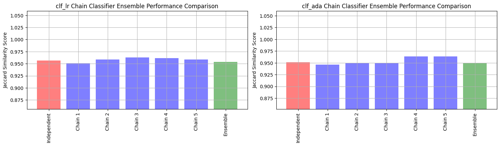
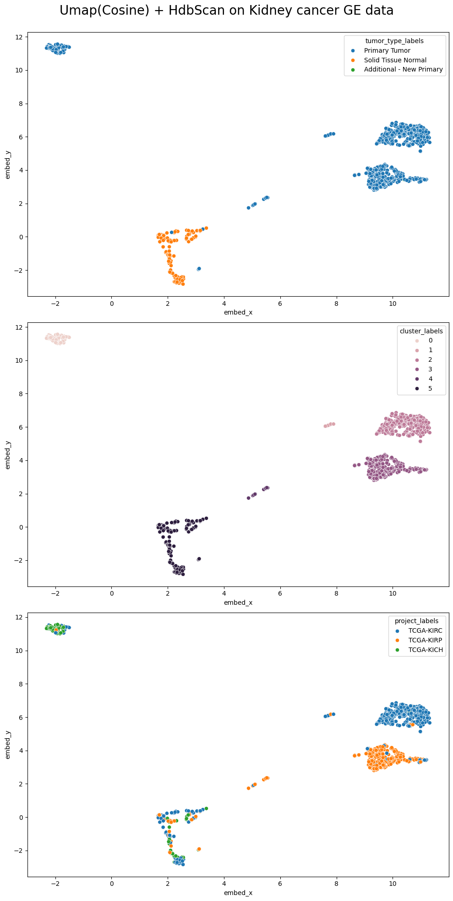

<!-- This is a collection of some personal projects I've worked on that are easily viewable online. Anything that is not browser-friendly will not make the cut :( -->

## Streamlining Data Science

Being a data scientist just means living openly - be it open source software, open science or open data. Recently, I've been active in exploring and trying to productionize different machine learning and deep learning tools to be used generalizably across different datasets.

### Current Projects (Always evolving):

**A. Data science for Bioinformatics (OmixHub)**: I'm working towards building well documented and easy to use modules and algorithms for different omics datasets. Initially, these tools are built for bulk RNA-Seq data, but will be updated for other Omics datasets. Below are some high-level objectives for this vision:

 - **Tutorial for early stage Data scientists**: Help early stage researchers understad, utilize and develop generalizable tools for bioinformatics analysis. 
 - **Standardization of ML/DL and Bioinfo tools**: Developing and maintaining a streamlined code base for different bioinformatics and ML/DL algorithms.
  
- **Personal Projects**: Some jupyter notebooks showcasing current implemented ones are:
   - **[(11/2/2023) Differential Gene Expression](/files/DeSeqApplication/docs/workflow.md) using PyDeSeq in kidney cancer sub-types** 
     <!-- {:height="300" width="500"}**  -->
<!--  -->

   - **[(11/14/20223) Multi-label Supervised classification of kidney cancer subtypes and tumor grade](/files/SupervisedLearningApplication/docs/workflow.md)** 
     
<!--  -->
   
   - **[(11/21/2023)Evaluation of ensemble classifiers ](/files/SuperviseLearningEnsembleApplication/workflow.md)for multi-label classification for kidney cancer**

<!--  -->
  

   - **[(10/25/2023) Disease stratification](/files/UmapApplication/docs/workflow.md) using bayesian optimized UMAP and dbscan in kidney cancer**
<!--  -->
  - **[(4/2/2023) Analysis of ATAC-Seq Data]() (Incoming)**
  - **[(4/2/2023) MAG Reconstruction and Strain Resolution](Incoming)**

**Data source**:  A repository for open Omics data can be found on [Genomic data commons](https://portal.gdc.cancer.gov/repository).

**Codebase**: All the **streamlined modules** for all past/current/future project notebooks can be found at [OmixHub](https://github.com/adhal007/OmixHub).

**B. Data science for E-Commerce:**

While primarily being an expert in data science bioinformatics, I also enjoy streamling data science code across other domains. Here I demonstrate how streamling packages for a few commonly available datasets can be versatibly applied to other E-commerce datasets.  The high level objectives are:
- **Tutorial for early stage data scientists:** Help early stage data professionals develop generalizable tools for performing analysis for e-commerce companies similar to groupon, etc.

- **Practising Object Oriented Programming**: Help early stage data professionals understand code structures and adavnced programming in Python (Classes, Class Methods, etc) with real world data

- **Projects:**
  - **[(3/5/2024) Customer Segmentation using K-means clustering](/files/E_commerce_projects/customer_segmentation_model.md)**
  <!-- - **[(6/3/2024) Propensity score modelling using Casual Inference Package](/files/E_commerce_projects/propensity_score_matching.md)** -->
  - **[(3/26/2024) Analysis of Groupon Deals with minimal requirements using propensity scores](/files/E_commerce_projects/groupon_deals_data_analysis.md)**

**Data source**: Kaggle.

**Codebase**: All the streamlined modules for all past/current/future project notebooks can be found at [E-Commerce Projects](https://github.com/adhal007/Data-Science-with-Python).

**C. AI for Medicine** (will come up with a cooler name soon): A second project that I've recently started is assembling deep learning algorithms for different imaging analysis (inspired from the course specialization [AI for medicine: deeplearning.ai](https://www.deeplearning.ai/courses/ai-for-medicine-specialization/)) 

- Still in early stage development (Only modules - no tutorial notebooks)

**Codebase**: All the **streamlined modules** to be used in past/current/future project notebooks can be found [AI for Medicine](https://github.com/adhal007/AIMedicine).

### Grad School Projects:

During my masters, I developed my base programming and algorithm writing skills while doing my thesis in a quantitative genetics lab ([qtl-rocks](https://qtlrocks.notion.site/Quantitative-Genetics-Lab-a34943bdb6094b89b60fc1f10b2e20be)), studying, developing and applying scripts for genomic prediction and genome wide association studies. 

Additionally, I enjoyed undertaking various AI courses in the computer science department at [University of California, Davis](https://cs.ucdavis.edu/) which involved group projects that i've been a part of. Below are the list of such projects

- Evaluation of bayesian regression models in animal genomics  [(github](https://github.com/adhal007/SSBR-JWAS-Implementation)[,report)](https://www.overleaf.com/project/5e1408bb3d549100019e1d03)
- Deep learning methods for Intracranial hemorrhage detection [(report)](https://www.overleaf.com/1359439834vszcmwdsjymd#b028db)
- Real time strategy agents for starcraft II using tactical decision making [(github,](https://github.com/adhal007/SC2-GCP-CNN)[report)](https://www.overleaf.com/project/5c8f7547e49c3964192f4b09)

<!-- ### Software Development /Object Oriented Programming (OOP) Practices:
I'm a big advocate of writing re-usable and streamline code for data science projects. Some of the modules that I've built for my personal bioinformatics projects can be found on [OmixHub](https://github.com/adhal007/OmixHub). Some of the crucial and advanced concepts of **inheritance, polymorphism, encapsulation and abstraction** can be seen in all of the modules.

Here is a list of some useful tools that can be found:

- **[Base Preprocessor](https://github.com/adhal007/OmixHub/blob/main/src/base_preprocessor.py)**
  - Example class with methods and attributes inherited by child classes. Some key methods provided are:
    - data skew
    - data leakage
    - patient overlap
    - training_testing_split 
    - etc
- **[Base ml models wrapper](https://github.com/adhal007/OmixHub/blob/main/src/base_ml_models.py)**
  - Example class with functionality to evaluate and plot multiple ML models for a data science application. This is intended to be inherited by specific child classes for building models for different Omics data
- **[Dimensionality reduction and clustering wrapper](https://github.com/adhal007/OmixHub/blob/main/src/DimRedMappers/README.md)**
  - Interfaces with Preprocessor classes to facilitate easy application of UMAP and clustering
- **[Differential Analysis Wrapper](https://github.com/adhal007/OmixHub/blob/main/src/pydeseq_utils.py)**
  - Faciliatates easy application of pydyseq in a few lines to perform differential analysis -->

